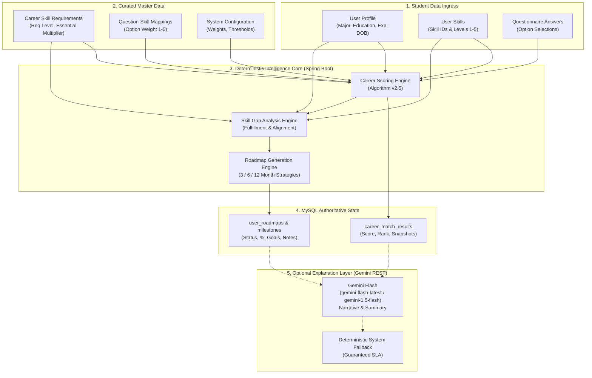

# SkillPilot — Autonomous Career Intelligence Engine & Technical Architecture

**Document ID:** ARCH-CIE-001  
**Authoritative Reference:** Algorithm v2.5 Enterprise  
**Generated:** September 2026  
**Status:** Canonical & Audited  

---

## 1. End-to-End Intelligence Architecture Overview

SkillPilot transforms student profiles, self-assessed competencies, questionnaire responses, and target career goals into actionable, deterministic execution roadmaps.



---

## 2. Career Recommendation Logic (`CareerScoringEngine.java`)

### 2.1 Inputs
1. **Career Entity (`Career`):** Contains list of `CareerSkillRequirement` entities with required level $L_{req} \in [1, 5]$ and essential flag $E \in \{\text{true}, \text{false}\}$.
2. **User Skills Map (`Map<String, Integer>`):** Map of skill IDs to user-assessed proficiency levels $L_{user} \in [1, 5]$. Missing skills default to $0$.
3. **Questionnaire Answers (`List<UserQuestionAnswer>`):** User responses containing selected option IDs mapped via `QuestionSkillMapping` to skills required by the career.
4. **System Configuration (`SystemConfig`):** Dynamic runtime parameters stored in MySQL.

### 2.2 System Configuration Parameters
- **`technicalWeight` ($W_{tech}$):** Default `0.50` (scaled to $75.0$ base scale).
- **`questionnaireWeight` ($W_{quest}$):** Default `0.35` (scaled to $25.0$ base cap).
- **`essentialSkillPenalty` ($P_{ess}$):** Default `0.15` (yields essential weight multiplier $M_{ess} = 2.0$).
- **`minimumMatchThreshold` ($T_{min}$):** Default `45` (minimum percentage for recommendation).

### 2.3 Exact Mathematical Formulas

#### Step 1: Essential Multiplier
$$M_{ess} = 1.0 + (P_{ess} \times 6.666)$$
*(When $P_{ess} = 0.15$, $M_{ess} = 1.0 + 0.9999 \approx 2.0$)*

#### Step 2: Technical Skill Fulfillment & Weighting
For each required skill $i$ in career requirements:
$$w_i = \begin{cases} M_{ess}, & \text{if } E_i = \text{true} \\ 1.0, & \text{otherwise} \end{cases}$$

$$\text{TotalRequiredWeight} = \sum_{i=1}^{N} (L_{req, i} \times w_i)$$

$$\text{EarnedScore} = \sum_{i=1}^{N} (\min(L_{user, i}, L_{req, i}) \times w_i)$$

$$\text{SkillMatchRatio} = \frac{\text{EarnedScore}}{\text{TotalRequiredWeight}}$$

$$\text{ReadinessScore} = \text{clamp}\Big(\text{round}(\text{SkillMatchRatio} \times 100), 0, 100\Big)$$

#### Step 3: Normalized Questionnaire Contribution
Only questions with at least one option mapping to a skill required by the candidate career are deemed relevant ($N_{rel}$):
For each relevant question $q$:
$$S_q = \frac{\max_{opt \in q.selected} (w_{opt, career})}{5.0}$$

$$\text{TotalEarnedQuestionnaireScore} = \sum_{q=1}^{N_{rel}} S_q$$

$$\text{QuestionnaireNormalizedRatio} = \frac{\text{TotalEarnedQuestionnaireScore}}{N_{rel}}$$

$$\text{QuestionnaireBonus} = \text{QuestionnaireNormalizedRatio} \times \text{questCap}$$
*(Where $\text{questCap} = W_{quest} \times 71.42857 = 25.0$ when $W_{quest} = 0.35$)*

#### Step 4: Final Match Score Calculation
If relevant questionnaire answers exist and $\text{QuestionnaireBonus} > 0$:
$$\text{RawScore} = \text{round}\Big((\text{SkillMatchRatio} \times \text{techScale}) + \text{QuestionnaireBonus}\Big)$$
*(Where $\text{techScale} = W_{tech} \times 150.0 = 75.0$ when $W_{tech} = 0.50$)*

Otherwise (skill-only assessment):
$$\text{RawScore} = \text{round}(\text{SkillMatchRatio} \times 100.0)$$

$$\text{MatchScore} = \text{clamp}(\text{RawScore}, 0, 100)$$

#### Step 5: Confidence Level & Recommendation
- **`isRecommended`:** $\text{MatchScore} \ge T_{min}$ (45%)
- **`confidenceLevel`:**
  - $\text{MatchScore} \ge 85 \implies \text{"High"}$
  - $\text{MatchScore} \ge 70 \implies \text{"Medium"}$
  - $\text{MatchScore} \ge 45 \implies \text{"Moderate"}$
  - $\text{MatchScore} < 45 \implies \text{"Low"}$

---

### 2.4 Worked Numerical Example (Clearly Labelled Synthetic Example)

**Target Career:** Cloud Solutions Architect  
**Requirements:**
1. *Distributed Systems Architecture* (Level 4, Essential = true $\implies w_1 = 2.0$)
2. *Cloud Infrastructure (AWS/Azure)* (Level 3, Essential = true $\implies w_2 = 2.0$)
3. *Container Orchestration (Docker/K8s)* (Level 3, Non-Essential $\implies w_3 = 1.0$)

**User Assessed Skills:**
- Distributed Systems Architecture: Level 2
- Cloud Infrastructure: Level 3
- Container Orchestration: Level 1

**Calculations:**
$$\text{TotalRequiredWeight} = (4 \times 2.0) + (3 \times 2.0) + (3 \times 1.0) = 8.0 + 6.0 + 3.0 = 17.0$$
$$\text{EarnedScore} = (\min(2,4) \times 2.0) + (\min(3,3) \times 2.0) + (\min(1,3) \times 1.0) = (2 \times 2.0) + (3 \times 2.0) + (1 \times 1.0) = 4.0 + 6.0 + 1.0 = 11.0$$
$$\text{SkillMatchRatio} = \frac{11.0}{17.0} = 0.64706 \implies \text{ReadinessScore} = 65\%$$

**Questionnaire Contribution:**
- 2 relevant questions answered.
- Question 1: Selected option mapped with weight $4.0 \implies S_1 = 4.0 / 5.0 = 0.80$
- Question 2: Selected option mapped with weight $5.0 \implies S_2 = 5.0 / 5.0 = 1.00$
- $\text{QuestionnaireNormalizedRatio} = (0.80 + 1.00) / 2 = 0.90$
- $\text{QuestionnaireBonus} = 0.90 \times 25.0 = 22.5$

**Final Match Percentage:**
$$\text{RawScore} = \text{round}((0.64706 \times 75.0) + 22.5) = \text{round}(48.53 + 22.5) = \text{round}(71.03) = 71\%$$
**Outcome:** Match Score = **71%**, Readiness = **65%**, Confidence = **Medium**, Recommended = **True**.

---

### 2.5 Ranking & Persistence (`CareerDiscoveryService.java`)
- Active careers are scored and ranked deterministically:
  1. `matchScore` descending
  2. `careerId` ascending (strict deterministic tie-breaker)
- Each rank position is stored in `career_match_results` with:
  - `scoring_version`: `"v2.5"`
  - `config_snapshot`: JSON representation of active `SystemConfig`
  - `requirements_snapshot`: JSON representation of career skill requirements at calculation time
  - `key_strengths_json` and `key_gaps_json`

---

## 3. Skill Gap Analysis Logic (`SkillGapAnalysisEngine.java`)

### 3.1 Gap Determination & Fulfillment
For each career skill requirement:
$$\text{GapAmount} = \max(0, L_{req} - L_{current})$$
$$\text{Fulfillment} = \min\left(1.0, \frac{L_{current}}{L_{req}}\right)$$
$$w = \begin{cases} 2.0, & \text{if Essential} \\ 1.0, & \text{otherwise} \end{cases}$$

$$\text{SkillReadiness} = \text{clamp}\left(\text{round}\left(\frac{\sum (\text{Fulfillment} \times w)}{\sum w} \times 100\right), 0, 100\right)$$

### 3.2 Severity Classification & Experience Buffering
| Condition | Classification | Severity String | Priority Weight |
| :--- | :--- | :--- | :--- |
| $\text{GapAmount} = 0$ | `SATISFIED` | `"low"` | 1 |
| $\text{GapAmount} = 1$ AND $\text{RelevantExp} \ge 3$ yrs | `EXPERIENCE_SUPPORTED` | `"medium"` | 2 |
| $\text{GapAmount} \ge 3$ | `CRITICAL` | `"critical"` | 4 |
| $\text{GapAmount} = 2$ | `IMPORTANT` | `"high"` | 3 |
| $\text{GapAmount} = 1$ | `MINOR` | `"medium"` | 2 |

*Note:* When `EXPERIENCE_SUPPORTED` applies, the platform flags that domain experience buffers this minor gap and generates a specialized recommendation note.

### 3.3 Experience & Education Alignment
- **Experience Alignment ($A_{exp}$):**
  - $\text{RelevantExp} \ge 5\text{ yrs} \implies 100$
  - $\text{RelevantExp} \ge 3\text{ yrs} \implies 85$
  - $\text{RelevantExp} \ge 1\text{ yr} \implies 65$
  - $\text{RelevantExp} < 1\text{ yr} \implies 40$
- **Education Alignment ($A_{edu}$):**
  - Evaluated against user major (`majorFieldOfStudy`) and career category/title keywords.
  - Matches Computer Science, Software Engineering, Data Science, AI, or Tech $\implies 90$.
  - Matches Finance, Business, Quant, Economics for finance tracks $\implies 90$.
  - Baseline/unmatched $\implies 60$.

### 3.4 Overall Readiness Composite Formula
$$\text{OverallReadiness} = \text{clamp}\Big(\text{round}(0.60 \times \text{SkillReadiness} + 0.25 \times A_{exp} + 0.15 \times A_{edu}), 0, 100\Big)$$

### 3.5 Gap Ordering & Prioritization
Gaps are sorted deterministically:
1. `severityRank` descending (`critical` (4) $\to$ `high` (3) $\to$ `medium` (2) $\to$ `low` (1))
2. `skillId` ascending

---

## 4. Roadmap Generation Logic (`RoadmapGenerationEngine.java`)

### 4.1 Strategy Duration Matrix
The engine dynamically tailors phases and milestone goals based on selected duration:

| Duration | Strategy Name | Total Phases | Milestone Structure | Focus Allocation |
| :--- | :--- | :--- | :--- | :--- |
| **3 Months** | Intensive Quick-Win | 3 | Month 1, Month 2, Month 3 | Immediate critical gap mitigation, applied coding, portfolio quick-win. |
| **6 Months** | Standard Acceleration | 4 | Months 1–2, Month 3, Months 4–5, Month 6 | Foundation build, applied engineering, production hardening & CI/CD, portfolio defense. |
| **12 Months** | Comprehensive Mastery | 5 | Months 1–3, Months 4–6, Months 7–9, Months 10–11, Month 12 | Deep theory, enterprise tooling, distributed architecture, capstone cloud deployment, executive interviewing. |

### 4.2 Gap Priority Comparator
The gap allocation comparator determines which skill gaps are assigned to phase 1, phase 2, etc.:
1. `severityRank` descending
2. `isEssential` descending (essential skills always take precedence)
3. `gapAmount` descending (largest deficit addressed first)
4. `skillId` ascending

### 4.3 Progress Preservation & Regeneration (`RoadmapService.java`)
When a student regenerates a roadmap (e.g. changing from 6 to 12 months, or updating skills):
1. The engine inspects existing milestone records before clearing.
2. It builds memory maps: `previousSkillProgressMap` (keyed by `targetSkillId`) and `previousOrderProgressMap` (keyed by `phaseOrder`).
3. During new milestone generation, if an equivalent milestone exists, the student's `status`, `completionPercentage`, `notes`, and `completedAt` timestamp are **restored**, ensuring previous student effort is never discarded.

### 4.4 Real-Time Stale Detection
A roadmap is flagged as stale (`isStale = true`) if any of the following events occurred after the roadmap's `updated_at` timestamp:
- `user.updated_at > roadmap.updated_at` (Profile modified)
- `user_target_careers.selected_at > roadmap.updated_at` (Target career switched)
- `user_skills.updated_at > roadmap.updated_at` (Any skill rating updated)

---

## 5. Google Gemini AI Boundary & Governance

### 5.1 Absolute Demarcation
To ensure academic integrity, verifiable calculations, and zero hallucinations:

```
[ Deterministic Backend Core (Spring Boot) ]
  • Career match scores (0-100%)
  • Readiness scores (0-100%)
  • Skill gap amounts & classifications
  • Milestone schedules & priorities
            │
            ▼ (Fixed numerical facts passed in prompt)
[ Gemini Flash Layer (Optional) ]
  • Explanatory narrative
  • Executive summary for portfolio
            │
            ▼ (JSON output validated against strict schema)
[ Fallback Protection ]
  • If API key missing, rate-limited, or invalid:
    Instant deterministic system summary returned without latency.
```

### 5.2 Strict Architectural Rules
1. **Gemini NEVER computes numerical scores:** All percentages, ratings, and readiness levels are calculated strictly by Java code and passed as constants to Gemini prompts.
2. **Gemini NEVER decides roadmap milestones:** Phase orders, month ranges, and milestone goals are constructed deterministically from database templates and skill gap matrices.
3. **Guaranteed Fallback SLA:** `FallbackExplanationService.java` generates comprehensive, formatted explanations when Gemini is unavailable, ensuring 100% platform uptime.
4. **Audit Logging:** Every AI prompt, raw response, status (`SUCCESS` / `FALLBACK`), and model provider is audited in the MySQL `ai_generation_logs` table.
