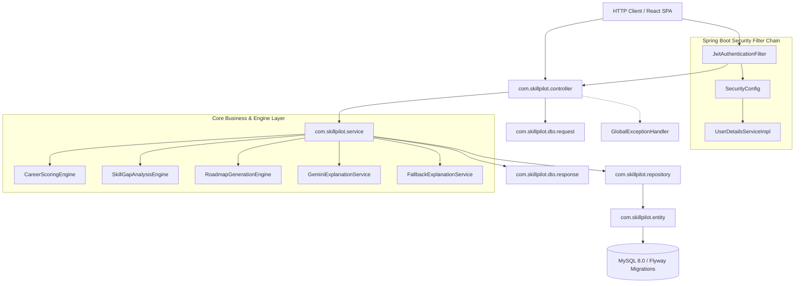

# SkillPilot — Backend Architecture Deep Dive

## 1. Overview of Backend Stack

The SkillPilot backend is built with **Spring Boot 3.2.x** and **Java 21**, following enterprise-grade Clean Architecture and Domain-Driven Design principles.

### Key Architectural Tenets:
- **Separation of Concerns**: Controllers handle HTTP validation; Services orchestrate business logic; Calculation Engines compute intelligence metrics; Repositories manage database persistence.
- **Strict Immutability**: Historical match evaluations and configuration snapshots are persisted to maintain retrospective accuracy.
- **Stateless Authorization**: JWT HMAC-512 tokens with role-based security.
- **Resilient AI Layer**: Google Gemini integration isolated behind strict fallback mechanisms.

---

## 2. Backend Package Architecture & Dependency Flow

---

## 3. Package-by-Package Breakdown

### 1. `com.skillpilot.controller`
- **Purpose**: Exposes REST API endpoints, handles HTTP serialization, validates incoming JSON payloads via `@Valid`, and translates application exceptions to standard HTTP error envelopes.
- **Who calls it**: React SPA / external REST clients via HTTP/HTTPS.
- **What it calls**: Corresponding Service layer interfaces (`AuthService`, `RoadmapService`, `CareerDiscoveryService`, etc.).
- **Important Classes**:
  - `AuthController.java`: User registration, login, token authentication, and password reset flows.
  - `CareerDiscoveryController.java`: Triggers deterministic scoring evaluations across active careers.
  - `TargetCareerController.java`: Manages student target career selections and triggers career-specific questionnaire updates.
  - `RoadmapController.java`: Generates 3/6/12-month roadmaps, fetches active roadmaps, and records milestone progress.
  - `AdminMasterDataController.java`: CRUD operations for careers, skills, requirements, questionnaire questions, and options.
  - `AdminSystemConfigController.java`: Real-time system health checks and algorithmic weight configuration updates.
  - `AiController.java`: On-demand AI explanations for careers, skill gaps, and roadmap milestones.

---

### 2. `com.skillpilot.service`
- **Purpose**: Encapsulates core business transactions, transactional boundaries (`@Transactional`), domain validations, and coordinates between database repositories and calculation engines.
- **Who calls it**: Controllers.
- **What it calls**: `com.skillpilot.repository`, Calculation Engines (`CareerScoringEngine`, `SkillGapAnalysisEngine`, `RoadmapGenerationEngine`), AI Services (`GeminiExplanationService`), and DTO Mappers.
- **Important Classes**:
  - `AuthService.java`: User account creation, BCrypt validation, JWT issuance, and password recovery token generation.
  - `UserProfileService.java`: 20-field profile intelligence management, completeness calculation, and user skill level synchronizations.
  - `CareerDiscoveryService.java`: Invokes `CareerScoringEngine`, enforces snapshot serialization (`configSnapshot`, `requirementsSnapshot`), and returns ranked career recommendations.
  - `SkillGapService.java`: Delegates to `SkillGapAnalysisEngine` to compute multi-dimensional readiness (skills, experience, education).
  - `RoadmapService.java`: Manages duration-aware roadmap generation, stale roadmap detection, and persistent milestone progress tracking (`PUT /api/user/roadmaps/{roadmapId}/milestones/{milestoneId}/progress`).
  - `SystemConfigService.java`: Evaluates master dataset health diagnostics (orphan skills, missing mappings) and calculates overall system health percentage.

---

### 3. `com.skillpilot.service.ai`
- **Purpose**: Houses Gemini AI prompt generation, response validation, and non-blocking rule-based fallback generation.
- **Who calls it**: `AiController.java`, `RoadmapService.java`, `CareerDiscoveryService.java`.
- **What it calls**: Google Gemini REST API endpoints, DTO response factories.
- **Important Classes**:
  - `GeminiExplanationService.java`: Builds structured prompt payloads and submits requests to Gemini Flash.
  - `FallbackExplanationService.java`: Provides deterministic, instant natural language explanations when Gemini is disabled, timed out, or quota-limited.
  - `GeminiPromptBuilder.java`: Sanitizes user metrics into concise prompt templates.
  - `GeminiResponseValidator.java`: Validates JSON and markdown structure returned from LLM.

---

### 4. `com.skillpilot.service` Engines (Deterministic Intelligence Core)
- **Purpose**: Computes mathematical, monotonic, and reproducible intelligence metrics.
- **Important Classes**:
  - `CareerScoringEngine.java` (Algorithm v2.5):
    - Computes raw match scores ($0\% \dots 100\%$) based on technical skill coverage and essential skill weights.
    - Adds normalized questionnaire bonuses scaled by relevant questions count.
    - Completely isolated from artificial clamping or ceiling ceilings ($100\%$ score is achievable).
  - `SkillGapAnalysisEngine.java`:
    - Evaluates required skill levels ($1 \dots 5$) against user skill levels.
    - Calculates Skill Readiness %, Experience Alignment %, Education Alignment %, and Overall Readiness %.
    - Classifies gaps into `CRITICAL`, `IMPORTANT`, `MINOR`, `EXPERIENCE_SUPPORTED`, and `SATISFIED`.
  - `RoadmapGenerationEngine.java`:
    - Generates 3-month (Rapid Intensive), 6-month (Standard Acceleration), and 12-month (Comprehensive Mastery) milestone sequences.
    - Orders milestones logically: Foundational & Prerequisites $\to$ Core Technical Competencies $\to$ Advanced Projects & Portfolios.

---

### 5. `com.skillpilot.repository`
- **Purpose**: Spring Data JPA interface layer providing type-safe CRUD operations, JPQL queries, and native SQL lookups against MySQL.
- **Who calls it**: Service classes.
- **What it calls**: Hibernate ORM / JDBC Driver.
- **Important Classes**:
  - `UserRepository.java`: Queries users by email and ID.
  - `CareerRepository.java`: Retrieves active careers and prerequisite definitions.
  - `CareerSkillRequirementRepository.java`: Queries skill requirements per career.
  - `UserSkillRepository.java`: Manages user skill ratings.
  - `UserTargetCareerRepository.java`: Tracks user target career selections.
  - `RoadmapRepository.java` & `RoadmapMilestoneRepository.java`: Persists roadmaps and milestone progress.
  - `SystemConfigRepository.java`: Loads key-value algorithmic configuration.

---

### 6. `com.skillpilot.entity`
- **Purpose**: Object-Relational Mapping (ORM) classes representing MySQL tables.
- **Who calls it**: Repositories and Services.
- **Important Classes**:
  - `User.java`: Stores credentials, role (`STUDENT`, `ADMIN`), 20 profile intelligence fields, and completeness %.
  - `Career.java`: Career definitions (title, category, salary, growth rate, demand level).
  - `Skill.java`: Master skill catalog (name, category, description, active status).
  - `CareerSkillRequirement.java`: Links careers to skills with required levels ($1-5$) and essential flags.
  - `Roadmap.java` & `RoadmapMilestone.java`: Stores duration, target career, and milestone status (`not_started`, `in_progress`, `completed`), progress %, notes, and timestamps.
  - `CareerMatchResult.java`: Stores match score, readiness score, and serialized JSON snapshots.

---

### 7. `com.skillpilot.dto.request` & `com.skillpilot.dto.response`
- **Purpose**: Defines strongly-typed contracts for incoming requests and outgoing API responses, shielding database entities from direct exposure.
- **Important Request DTOs**: `LoginRequest`, `RegisterRequest`, `ProfileUpdateRequest`, `MilestoneProgressUpdateRequest`, `RoadmapGenerateRequest`.
- **Important Response DTOs**: `AuthResponse`, `UserProfileResponse`, `CareerMatchResponse`, `SkillGapAnalysisResponse`, `CareerRoadmapResponse`, `SystemHealthResponse`.

---

### 8. `com.skillpilot.security`
- **Purpose**: Configures Spring Security filter chains, token parsing, and user authentication state.
- **Important Classes**:
  - `JwtAuthenticationFilter.java`: Extracts `Authorization: Bearer <token>`, validates token, and injects `SecurityUser` into Spring Security context.
  - `JwtTokenProvider.java`: Generates and validates HMAC-SHA512 JWTs.
  - `SecurityUser.java`: Implements Spring Security's `UserDetails` contract.
  - `UserDetailsServiceImpl.java`: Loads user records by email from MySQL.

---

### 9. `com.skillpilot.config`
- **Purpose**: Global application configuration beans.
- **Important Classes**:
  - `SecurityConfig.java`: Configures CORS, disables CSRF for stateless REST, sets endpoint authorization rules (`permitAll` vs `hasRole('ADMIN')`).
  - `CorsConfig.java`: Configures allowed origins (`http://localhost:3000`), methods (`GET`, `POST`, `PUT`, `DELETE`, `OPTIONS`), and headers.
  - `DefaultUserSeeder.java`: Seeds default admin and student accounts if database is empty.
  - `GeminiProperties.java`: Binds `gemini.*` properties from `application.yml`.

---

### 10. `com.skillpilot.exception`
- **Purpose**: Centralized error translation and custom domain exceptions.
- **Important Classes**:
  - `GlobalExceptionHandler.java`: Catches `ResourceNotFoundException`, `BadRequestException`, `ForbiddenException`, `UnauthorizedException`, and `MethodArgumentNotValidException`, returning standardized `ErrorResponse` JSON with timestamps and error codes.
