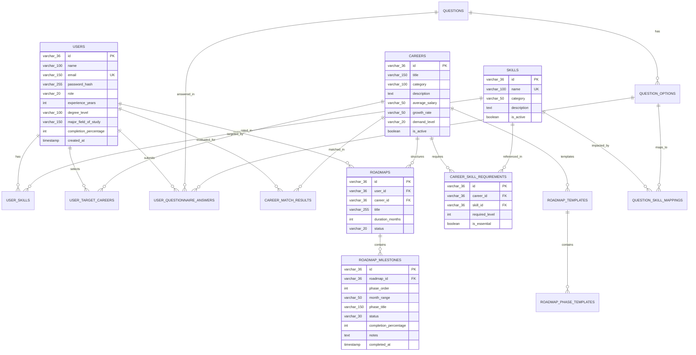

# SkillPilot — Database Architecture & Entity Relationship Model

## 1. Overview & Database Design Principles

SkillPilot uses **MySQL 8.0** with **Flyway** migration versioning. The schema is normalized into 3NF for operational tables while utilizing structured JSON columns for immutable historical evaluation snapshots.

### Core Database Principles:
- **Relational Integrity**: Foreign keys with `ON DELETE CASCADE` ensure child records (skills, options, milestones) clean up consistently when parent entities are removed.
- **Snapshot Immutability**: Historical evaluations (`career_match_results`) serialize full configuration and requirement state as JSON to preserve audit history against future master data edits.
- **Milestone Progress Persistence**: Milestone progress %, notes, and completion timestamps are stored directly in MySQL (`roadmap_milestones`), surviving refreshes, career switching, and regenerations.
- **Flyway Versioning**: All schema alterations are version-controlled across migrations `V1` through `V8`.

---

## 2. Entity Relationship Diagram (ERD)

---

## 3. Comprehensive Table Catalog

### 1. `users`
Stores user authentication credentials, role (`STUDENT`, `ADMIN`), and 20 expanded User Intelligence fields.
- **Primary Key**: `id` (`VARCHAR(36)` UUID)
- **Key Columns**: `name`, `email` (`UNIQUE`), `password_hash`, `role`, `institution_name`, `degree_level`, `major_field_of_study`, `graduation_year`, `education_status`, `experience_years`, `employment_status`, `current_job_title`, `current_industry`, `relevant_experience_years`, `location`, `country`, `target_focus`, `preferred_work_mode`, `preferred_employment_type`, `career_goal`, `weekly_hours_available`, `preferred_learning_pace`, `preferred_roadmap_duration`, `completion_percentage`.

---

### 2. `skills`
Master catalog of technical, domain, and soft skills.
- **Primary Key**: `id` (`VARCHAR(36)`)
- **Key Columns**: `name` (`UNIQUE`), `category` (`VARCHAR(50)`), `description` (`TEXT`), `is_active` (`BOOLEAN`).

---

### 3. `careers`
Catalog of industry careers and job roles.
- **Primary Key**: `id` (`VARCHAR(36)`)
- **Key Columns**: `title` (`VARCHAR(150)`), `category` (`VARCHAR(100)`), `description` (`TEXT`), `average_salary` (`VARCHAR(50)`), `growth_rate` (`VARCHAR(50)`), `demand_level` (`VARCHAR(20)`), `prerequisites` (`TEXT` JSON), `typical_roles` (`TEXT` JSON), `is_active` (`BOOLEAN`).

---

### 4. `career_skill_requirements`
Relational join linking careers to required skills with proficiency ratings.
- **Primary Key**: `id` (`VARCHAR(36)`)
- **Foreign Keys**:
  - `career_id` $\to$ `careers(id)` (`ON DELETE CASCADE`)
  - `skill_id` $\to$ `skills(id)` (`ON DELETE CASCADE`)
- **Key Columns**: `required_level` (`INT 1-5`), `is_essential` (`BOOLEAN`).

---

### 5. `user_skills`
Stores student self-assessed proficiency ratings.
- **Primary Key**: `id` (`VARCHAR(36)`)
- **Foreign Keys**:
  - `user_id` $\to$ `users(id)` (`ON DELETE CASCADE`)
  - `skill_id` $\to$ `skills(id)` (`ON DELETE CASCADE`)
- **Key Columns**: `level` (`INT 0-5`), `assessed_at` (`TIMESTAMP`).

---

### 6. `user_target_careers`
Tracks the single active target career selected by the student.
- **Primary Key**: `id` (`VARCHAR(36)`)
- **Foreign Keys**:
  - `user_id` $\to$ `users(id)` (`ON DELETE CASCADE`)
  - `career_id` $\to$ `careers(id)` (`ON DELETE CASCADE`)
- **Key Columns**: `selected_at` (`TIMESTAMP`).

---

### 7. `questions` & `question_options` & `question_skill_mappings`
Dynamic questionnaire engine tables.
- **`questions`**: `id`, `section`, `question_text`, `question_type` (`single`, `multiple`, `scale`), `order_index`, `career_id` (optional career-specific link).
- **`question_options`**: `id`, `question_id` (FK `CASCADE`), `option_text`, `weight_multiplier`, `order_index`.
- **`question_skill_mappings`**: `id`, `option_id` (FK `CASCADE`), `skill_id` (FK `CASCADE`), `skill_weight` (`DECIMAL(3,2)`).

---

### 8. `user_questionnaire_answers`
Stores user responses to questionnaire items.
- **Primary Key**: `id` (`VARCHAR(36)`)
- **Foreign Keys**:
  - `user_id` $\to$ `users(id)` (`ON DELETE CASCADE`)
  - `question_id` $\to$ `questions(id)` (`ON DELETE CASCADE`)
  - `option_id` $\to$ `question_options(id)` (`ON DELETE CASCADE`)

---

### 9. `roadmaps` & `roadmap_milestones`
Stores duration-aware learning roadmaps and persistent milestone execution progress.
- **`roadmaps`**: `id`, `user_id` (FK `CASCADE`), `career_id` (FK `CASCADE`), `title`, `duration_months` (3, 6, or 12), `status`, `created_at`, `updated_at`.
- **`roadmap_milestones`**:
  - **Primary Key**: `id` (`VARCHAR(36)`)
  - **Foreign Key**: `roadmap_id` $\to$ `roadmaps(id)` (`ON DELETE CASCADE`)
  - **Key Columns**: `phase_order` (`INT`), `month_range` (`VARCHAR(50)`), `phase_title` (`VARCHAR(150)`), `milestone_description` (`TEXT`), `key_actions` (`TEXT` JSON), `target_skills` (`TEXT` JSON), `recommended_projects` (`TEXT` JSON), `status` (`VARCHAR(30)`: `not_started`, `in_progress`, `completed`), `completion_percentage` (`INT 0-100`), `notes` (`TEXT`), `completed_at` (`TIMESTAMP`).

---

### 10. `career_match_results`
Stores immutable calculation results for career discovery evaluations.
- **Primary Key**: `id` (`VARCHAR(36)`)
- **Foreign Keys**: `user_id` (FK), `career_id` (FK)
- **Key Columns**: `match_score` (`DECIMAL(5,2)`), `readiness_score` (`DECIMAL(5,2)`), `fit_reason` (`TEXT`), `strengths` (`TEXT` JSON), `gaps` (`TEXT` JSON), `config_snapshot` (`TEXT` JSON), `requirements_snapshot` (`TEXT` JSON), `evaluated_at` (`TIMESTAMP`).

---

### 11. `system_configs`
Stores runtime algorithmic weights and thresholds.
- **Primary Key**: `id` (`VARCHAR(36)`)
- **Key Columns**: `config_key` (`VARCHAR(100)` `UNIQUE`), `config_value` (`VARCHAR(255)`), `description` (`TEXT`), `data_type` (`VARCHAR(20)`).

---

## 4. Flyway Migration History

| Version | Migration Script | Description |
|---|---|---|
| **V1** | `V1__initial_schema.sql` | Base schema: users, skills, careers, requirements, roadmaps, questions. |
| **V2** | `V2__seed_master_data.sql` | Initial master data seed (skills, careers, question options). |
| **V3** | `V3__add_scoring_version.sql` | Added algorithm version column to system configs. |
| **V4** | `V4__add_updated_at_career_match_results.sql`| Added timestamp column for match snapshot tracking. |
| **V5** | `V5__seed_missing_career_requirements_and_non_it_questions.sql`| Added non-IT questionnaire options and career skill links. |
| **V6** | `V6__expand_master_dataset.sql` | Expanded dataset to 36 careers, 92 skills, and 177 requirements. |
| **V7** | `V7__fix_master_dataset_audit_warnings.sql`| Master dataset cleanup, orphan skill deactivation, 100/100 health. |
| **V8** | `V8__expand_user_profile_and_roadmap_tracking.sql` | Added 20 user intelligence fields and persistent milestone tracking columns. |
