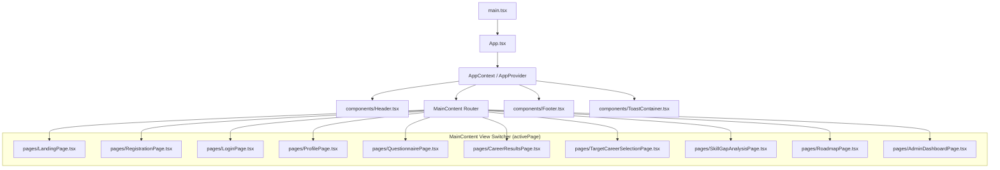

# SkillPilot — Frontend Architecture & State Flow

## 1. Frontend Technology Stack & Design Principles

The SkillPilot client application is built with modern, battle-tested web technologies:
- **Framework**: React 19 + TypeScript
- **Build Tool**: Vite (blazing-fast HMR and optimized production bundles)
- **Styling**: Tailwind CSS (clean utility-first styling with responsive layouts and dark slate aesthetics)
- **Icons**: Lucide React
- **State Architecture**: Centralized React Context (`AppContext.tsx`) with atomic state transitions and localStorage persistence.

---

## 2. Component & Layout Hierarchy

---

## 3. Core Frontend Modules Breakdown

### 1. `main.tsx` & `App.tsx`
- **`main.tsx`**: Entry point for the Vite SPA. Mounts `App` into `document.getElementById('root')` wrapped in React `StrictMode`.
- **`App.tsx`**: Defines top-level shell layout:
  - Embeds `<Header />`, `<MainContent />`, `<Footer />`, and `<ToastContainer />`.
  - Implements route protection logic (`isProtectedRoute = ['admin', 'profile', 'skill-gap', 'roadmap', 'target-selection']`).
  - Displays session restoration spinner while validating JWT tokens on browser refresh.

---

### 2. `src/context/AppContext.tsx` (The State Brain)
`AppContext.tsx` manages the entire application state, handling authentication, profile synchronization, API communications, and optimistic UI updates.

#### Key State Variables:
- `user`: Authenticated user profile object (`UserProfile`).
- `token`: Bearer JWT string stored in `localStorage` (`skillpilot_jwt_token`).
- `userRole`: `'guest' | 'student' | 'admin'`.
- `activePage`: Current active view identifier (`PageId`).
- `allCareers`: Master list of active careers loaded from `/api/careers`.
- `allSkills`: Master list of catalog skills loaded from `/api/skills`.
- `targetCareer`: Currently selected target career (`Career | null`).
- `backendSkillGap`: Career-specific skill gap response (`SkillGapAnalysisResponse | null`).
- `activeRoadmap`: Active user roadmap with persistent milestones (`CareerRoadmapResponse | null`).
- `questionnaire`: Career-specific or general questionnaire items (`QuestionItem[]`).

#### Key Action Handlers:
- `login(email, password)`: Submits credentials to `/api/auth/login`, stores JWT, bootstraps profile context, and navigates to `'profile'`.
- `logout()`: Clears token, resets state, and redirects to `'landing'`.
- `updateProfile(fields)`: Synchronizes 20 user intelligence fields with `/api/user/profile`.
- `updateSkill(skillId, level)`: Updates user proficiency rating ($0-5$) with `/api/user/skills`.
- `selectTargetCareer(careerId)`: Atomically invalidates past career data, updates target career, and reloads career-specific questionnaire, skill gaps, and roadmap.
- `updateMilestoneProgress(milestoneId, status, progress, notes)`: Updates milestone progress on `/api/user/roadmaps/{id}/milestones/{id}/progress`.
- `generateRoadmap(durationMonths)`: Requests duration-aware roadmap generation (3, 6, or 12 months).

---

### 3. Screen Views (`src/pages/`)

| Page Component | Path / Route ID | Key Responsibilities & Capabilities |
|---|---|---|
| **`LandingPage.tsx`** | `'landing'` | Hero section, value propositions, unauthenticated interactive preview with sample career matches. |
| **`RegistrationPage.tsx`** | `'register'` | Multi-step registration capturing account credentials, education, and career interests. |
| **`LoginPage.tsx`** | `'login'` | Secure login form with remember-me, demo credentials switcher, and forgot-password recovery. |
| **`ProfilePage.tsx`** | `'profile'` | 20-field User Intelligence editor, profile completeness meter ($0-100\%$), target career skill requirement badges (`Req: Lvl X`, `[ESSENTIAL]`, `Gap: -X`), and skill level sliders ($0-5$). |
| **`QuestionnairePage.tsx`** | `'questionnaire'` | Dynamic questionnaire wizard supporting Single, Multiple, and Scale questions mapped directly to target career competencies. |
| **`CareerResultsPage.tsx`** | `'results'` | Displays ranked career matches computed by Algorithm v2.5, Match Score & Readiness Score gauges, AI insights, and direct target career selection. |
| **`TargetCareerSelectionPage.tsx`**| `'target-selection'`| Grid of 36 industry careers with category filtering, salary statistics, demand level badges, and direct selection. |
| **`SkillGapAnalysisPage.tsx`** | `'skill-gap'` | Visualizes multi-dimensional readiness (Skill %, Experience %, Education %, Overall %), gap classification badges (`CRITICAL`, `IMPORTANT`, `MINOR`, `EXPERIENCE_SUPPORTED`), and prioritized action steps. |
| **`RoadmapPage.tsx`** | `'roadmap'` | Duration selector (3, 6, 12 months), chronological milestone cards, interactive completion sliders ($0-100\%$), milestone notes editor, stale roadmap warning banner, and Gemini AI advice modal. |
| **`AdminDashboardPage.tsx`** | `'admin'` | Full administrative command center: System Health Score Gauge ($0-100\%$), CRUD management for Careers, Skills, Skill Requirements, Questionnaire Questions, and Algorithmic Scoring Weights. |

---

### 4. Shared UI Components (`src/components/`)
- **`Header.tsx`**: Responsive navigation bar with role-aware links (Student vs Admin), profile completeness badge, target career quick-badge, and authentication buttons.
- **`Footer.tsx`**: Platform branding, navigation links, and system architecture status tags.
- **`ToastContainer.tsx`**: Non-blocking toast notification stack for success, warning, and error alerts.

---

### 5. Data Types & Contracts (`src/types.ts`)
Houses universal TypeScript interfaces matching Spring Boot DTOs (`UserProfile`, `Career`, `SkillRequirement`, `CareerMatchResult`, `SkillGapItem`, `SkillGapAnalysisResponse`, `RoadmapMilestone`, `CareerRoadmapResponse`, `SystemHealthResponse`).
