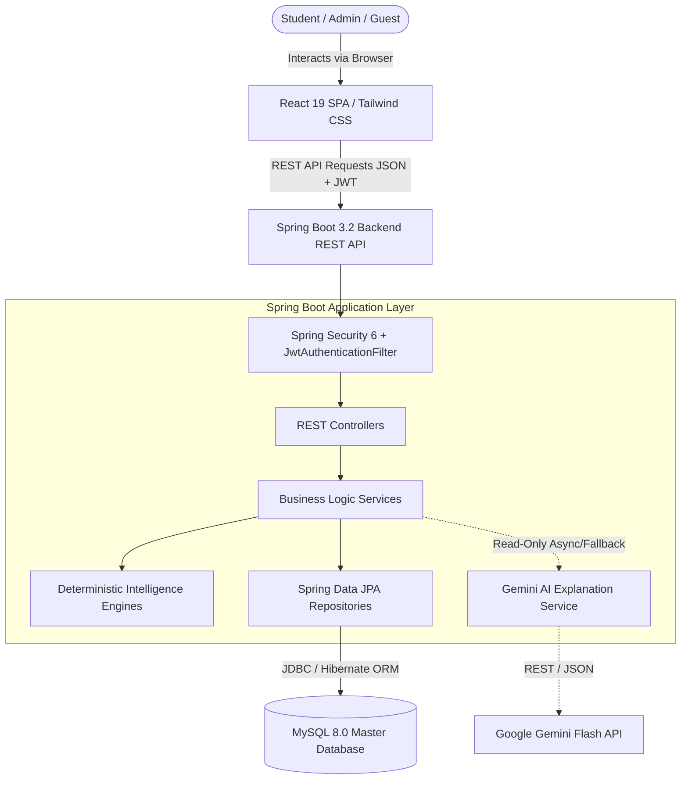
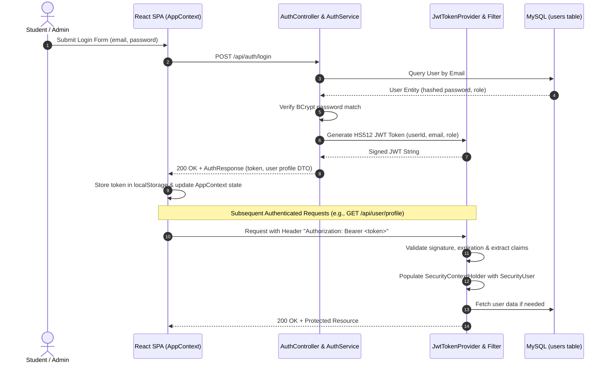

# SkillPilot — High-Level Project Architecture

## 1. Executive Summary

**SkillPilot** is an enterprise-grade, AI-powered Career Intelligence & Dynamic Learning Roadmap platform. It bridges the gap between a student's current competencies, education, and professional experience, and the real-world demands of industry careers.

The architecture is built on strict software engineering principles:
1. **Authoritative Backend**: 100% of career discovery calculations, skill gap analysis, and roadmap generation are performed by deterministic, reproducible Java engines on Spring Boot backed by MySQL.
2. **Read-Only AI Enrichment Layer**: Google Gemini LLM operates purely as an advisory, read-only explanation layer. It never mutates scores, readiness percentages, or milestone structures.
3. **Reactive Presentation Layer**: A modern React 19 + TypeScript Single Page Application (SPA) styled with Tailwind CSS, utilizing React Context for atomic state management and seamless authenticated transitions.

---

## 2. High-Level System Flow & Request Lifecycle

The entire platform operates on an end-to-end client-server architecture:



### Complete Request Lifecycle (Step-by-Step)
1. **Browser / Presentation (React SPA)**:
   - The user interacts with the UI (e.g., updates skills, selects a target career, requests roadmap generation).
   - `AppContext.tsx` or page components construct standard HTTP requests with JSON payloads and attach the user's Bearer JWT in the `Authorization` header.
2. **Gateway & Security Filtering**:
   - `JwtAuthenticationFilter` intercepts the request, extracts and verifies the HMAC-SHA512 token against `JwtTokenProvider`, and loads user principals into `SecurityContextHolder`.
   - `SecurityConfig` enforces Role-Based Access Control (RBAC): public endpoints (`/api/auth/**`, `/api/health`), authenticated user endpoints (`/api/user/**`), and strictly protected administrative endpoints (`/api/admin/**`).
3. **REST Controller Mapping**:
   - Spring Boot matches the route to the appropriate controller (e.g., `RoadmapController`, `CareerDiscoveryController`).
   - Request bodies are validated using Jakarta Validation annotations (`@Valid`, `@NotBlank`, etc.).
4. **Service & Engine Execution**:
   - The controller delegates work to the Service layer (e.g., `RoadmapService`).
   - The service fetches authoritative data from MySQL via Spring Data JPA Repositories.
   - The service invokes the backend **Deterministic Calculation Engines** (`CareerScoringEngine`, `SkillGapAnalysisEngine`, `RoadmapGenerationEngine`).
5. **AI Advisory Layer (Optional Enrichment)**:
   - For explanations or advice, `GeminiExplanationService` formats sanitized context into strict prompts.
   - If Gemini is unreachable or disabled, `FallbackExplanationService` deterministically generates rich textual summaries with zero latency impact.
6. **Data Persistence**:
   - Repositories persist updates (e.g., milestone progress, historical match snapshots) to MySQL within `@Transactional` boundaries.
7. **Response Serialization**:
   - Data Transfer Objects (DTOs) serialize clean JSON back to the client with appropriate HTTP status codes (200 OK, 201 Created, 400 Bad Request, 401 Unauthorized, 403 Forbidden, 404 Not Found).

---

## 3. Where Gemini AI Fits (Strict Boundary Model)

SkillPilot maintains a strict decoupling between **Business Logic** and **Artificial Intelligence**:

| Metric / Dimension | Deterministic Engine (Authoritative) | Gemini AI Layer (Advisory Only) |
|---|---|---|
| **Match Score ($0-100\%$)** | Calculated via weighted skill vectors & question bonuses | **NEVER** modifies or recalculates |
| **Readiness Percentage** | Computed via multi-dimensional skill, experience, & education models | **NEVER** modifies or recalculates |
| **Skill Gap Classification** | Calculated mathematically (`CRITICAL`, `IMPORTANT`, `MINOR`, `SATISFIED`) | **NEVER** alters gap severity |
| **Roadmap Milestones** | Generated based on duration (3/6/12 mos) & prerequisite sequences | **NEVER** reorders or removes milestones |
| **Natural Language Explanations** | Rule-based deterministic fallbacks | Synthesizes personalized career & milestone advice |
| **Fault Tolerance** | Always available (100% in-process Java) | Non-blocking fallback if timeout or quota exceeded |

```
+-----------------------------------------------------------------------------+
|                                MySQL DATABASE                               |
|   (Master Dataset: 36 Careers, 92 Skills, 177 Requirements, User Profiles)  |
+--------------------------------------+--------------------------------------+
                                       |
                                       v
+-----------------------------------------------------------------------------+
|                     BACKEND DETERMINISTIC ENGINES (Java)                    |
|   - CareerScoringEngine (Algorithm v2.5)                                    |
|   - SkillGapAnalysisEngine (Multi-dimensional readiness)                    |
|   - RoadmapGenerationEngine (Duration & prerequisite-aware)                 |
+--------------------------------------+--------------------------------------+
                                       |
                                       v
+-----------------------------------------------------------------------------+
|                  AUTHORITATIVE SCORES, GAPS & ROADMAP DTOs                  |
+--------------------------------------+--------------------------------------+
                                       |
                                       +----------------------------+
                                       |                            |
                                       v (Scores & Gaps)            v (Context)
                     +----------------------------------+ +-------------------+
                     |           REACT SPA UI           | | Gemini AI Engine  |
                     |  Displays gauges, gaps, progress | | (Advisory Text)   |
                     +----------------------------------+ +-------------------+
```

---

## 4. Authentication & Security Lifecycle

SkillPilot utilizes stateless **JSON Web Token (JWT)** authentication backed by BCrypt password hashing:



### Key Security Guardrails
1. **Password Encryption**: Passwords are never stored in plaintext; BCrypt with salt rounds is enforced by `PasswordEncoder`.
2. **HMAC-SHA512 Signing**: JWT tokens are signed using a minimum 512-bit secret key (`JWT_SECRET`).
3. **IDOR Prevention**: All user endpoints derive identity directly from `@AuthenticationPrincipal SecurityUser` in the security context, ignoring arbitrary client-supplied IDs.
4. **Role Isolation**: Admin APIs (`/api/admin/**`) require `@PreAuthorize("hasRole('ADMIN')")`.

---

## 5. Repository Folder Hierarchy

```
skillpilot/
├── backend/                              # Spring Boot 3.2 Java Backend
│   ├── mvnw, mvnw.cmd, pom.xml           # Maven wrapper and dependencies
│   └── src/
│       ├── main/
│       │   ├── java/com/skillpilot/
│       │   │   ├── SkillPilotApplication.java
│       │   │   ├── config/               # Security, CORS, Seeders
│       │   │   ├── controller/           # REST Controllers (Auth, User, Admin, etc.)
│       │   │   ├── dto/                  # Data Transfer Objects (Request & Response)
│       │   │   ├── entity/               # JPA Entity models
│       │   │   ├── exception/            # Global exception handlers & custom errors
│       │   │   ├── repository/           # Spring Data JPA repositories
│       │   │   ├── security/             # JWT filter, token provider, user details
│       │   │   └── service/              # Core business services, engines & AI
│       │   │       └── ai/               # Gemini AI & Fallback explanation services
│       │   └── resources/
│       │       ├── application.yml       # Production/default configuration
│       │       └── db/migration/         # Flyway SQL migrations (V1 -> V8)
│       └── test/                         # 172 JUnit 5 integration & engine tests
│
├── frontend/                             # React 19 + TypeScript + Vite SPA
│   ├── package.json, vite.config.ts      # Node dependencies & Vite build setup
│   ├── tailwind.config.js, postcss.config.js
│   └── src/
│       ├── App.tsx                       # Main layout and top-level view router
│       ├── main.tsx                      # Vite React entry point
│       ├── index.css                     # Tailwind CSS imports & global styles
│       ├── types.ts                      # Universal TypeScript interfaces & models
│       ├── components/                   # Shared UI (Header, Footer, ToastContainer)
│       ├── context/                      # React Context (AppContext.tsx state engine)
│       ├── pages/                        # 10 Screen views (Profile, Roadmap, Admin, etc.)
│       ├── utils/                        # Frontend math helpers & formatters
│       └── data/                         # Preview fallbacks for unauthenticated guests
│
└── docs/                                 # Central Documentation Repository
    ├── IMPLEMENTATION_HISTORY.md         # Milestone and changelog history
    ├── README.md                         # Project documentation index
    ├── architecture/                     # Deep-dive architecture whitepapers
    ├── audits/                           # Security, benchmark & system audits
    ├── bootcamp/                         # Comprehensive Bootcamp Learning Modules
    ├── data/                             # Dataset audits & schema dictionaries
    ├── decisions/                        # Architectural Decision Records (ADRs)
    ├── implementation/                   # Historical sprint plans & roadmaps
    ├── phases/                           # Validation test phase records
    ├── product/                          # Product requirement specifications
    ├── project/                          # Project status & governance reports
    └── testing/                          # Test suites & acceptance verification
```
