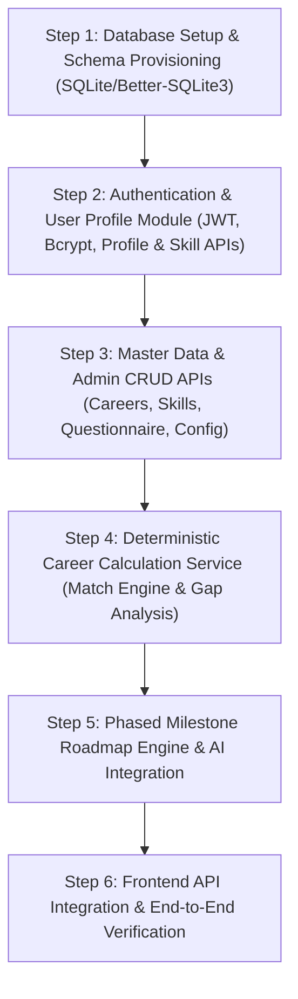

# SkillPilot Technical Inspection Report & Backend Architecture Plan

## Executive Summary
SkillPilot is an AI-powered Career Intelligence & Roadmap Platform built with React 19, TypeScript, Tailwind CSS, Vite, and Express. The frontend UI is fully built with high visual fidelity, complete user flows, and interactive state management driven by React Context (`AppContext.tsx`) and deterministic mathematical models (`careerEngine.ts`). 

Currently, the application runs on client-side mock data (`mockData.ts`) and client-side calculations, with only one backend endpoint (`/api/ai/enhance-summary` in `server.ts`) calling the Google Gemini API (`@google/genai`).

This document provides a comprehensive technical audit of the repository, a screen-by-screen API contract mapping matching existing TypeScript interfaces, identified architectural risks, and a step-by-step recommended backend implementation order.

---

## 1. System Inspection Overview

### 1.1 Frontend Framework & Core Stack
- **Framework**: React 19 (`react` `^19.0.1`, `react-dom` `^19.0.1`)
- **Build Tool / Development Server**: Vite `^6.2.3` with `@vitejs/plugin-react` `^5.0.4`
- **Styling**: Tailwind CSS v4 (`@tailwindcss/vite` `^4.1.14`, `tailwindcss` `^4.1.14`, `autoprefixer` `^10.4.21`)
- **Iconography & Motion**: `lucide-react` `^0.546.0`, `motion` `^12.23.24`
- **Language & Compiler**: TypeScript `~5.8.2`
- **Backend Runtime & Runner**: Express `^4.21.2` executed via `tsx` `^4.21.0` (`server.ts`)

### 1.2 `package.json` Scripts & Dependencies Analysis
- **`npm run dev`**: Runs `tsx server.ts`. The Express server configures Vite middleware in non-production mode, serving SPA assets on `http://localhost:3000`.
- **`npm run build`**: Runs `vite build` to bundle frontend assets to `dist/`, then uses `esbuild` to bundle `server.ts` to `dist/server.cjs`.
- **`npm start`**: Runs `node dist/server.cjs` for production runtime.
- **`npm run lint`**: Runs `tsc --noEmit` to verify type safety.

### 1.3 Routing Architecture
- **Router Library**: None (Single Page Application using internal React State).
- **State Key**: `activePage` inside `AppContext.tsx` (`PageId` union type).
- **Supported Page Identifiers**:
  - `'landing'`: `LandingPage.tsx`
  - `'register'`: `RegistrationPage.tsx`
  - `'login'`: `LoginPage.tsx`
  - `'profile'`: `ProfilePage.tsx`
  - `'questionnaire'`: `QuestionnairePage.tsx`
  - `'results'`: `CareerResultsPage.tsx`
  - `'target-selection'`: `TargetCareerSelectionPage.tsx`
  - `'skill-gap'`: `SkillGapAnalysisPage.tsx`
  - `'roadmap'`: `RoadmapPage.tsx`
  - `'admin'`: `AdminDashboardPage.tsx`

### 1.4 Global State Management & Persistence
- **State Provider**: `AppContext.tsx` (`AppProvider` wrapper in `App.tsx`).
- **Global State Variables**:
  - `userRole`: `'guest' | 'student' | 'admin'` (defaults to `'guest'`)
  - `activePage`: `'landing' | 'register' | ...`
  - `userProfile`: `UserProfile` object (defaults to `MOCK_USER_PROFILE`)
  - `careers`: `Career[]` (defaults to `INITIAL_CAREERS`)
  - `questionnaire`: `QuestionItem[]` (defaults to `INITIAL_QUESTIONNAIRE`)
  - `skillsList`: `INITIAL_SKILLS` array (18 skills)
  - `systemConfig`: `SystemConfig` (defaults to `DEFAULT_SYSTEM_CONFIG`)
  - `questionnaireAnswers`: `Record<string, string | string[]>` (prefilled demo answers)
  - `selectedTargetCareerId`: `string` (defaults to `'ai-software-engineer'`)
  - `toasts`: `ToastAlert[]`
  - `aiEnhancing`: `boolean`
- **Calculated / Derived State**:
  - `careerMatches`: Computed via `calculateCareerMatch()` in `careerEngine.ts`.
  - `skillGaps`: Computed via `calculateSkillGaps()` in `careerEngine.ts`.
  - `activeRoadmap`: Initialized via `SAMPLE_ROADMAPS` or `generateRoadmapForCareer()` in `careerEngine.ts`.
- **Browser Storage Usage**: Currently **zero** `localStorage` or `sessionStorage` usage. All state resides strictly in React memory and resets on browser refresh.

### 1.5 Existing Backend Code (`server.ts`)
- **Framework**: Express app with `express.json()` middleware.
- **Implemented Endpoints**:
  1. `GET /api/health` -> Returns `{ status: "ok", app: "SkillPilot AI" }`.
  2. `POST /api/ai/enhance-summary` -> Polishes career summary text using `@google/genai` model `gemini-3.6-flash`. Includes a structured template fallback if `GEMINI_API_KEY` is missing or fails.
- **Environment Variables (.env.example)**:
  - `GEMINI_API_KEY`: API key for Gemini 3.6 Flash inference.
  - `APP_URL`: Host URL configuration.

### 1.6 Existing Database Configuration
- **Current State**: None. There is no database driver, ORM, or database file configured in the repository.

---

## 2. Screen-by-Screen API Contract & Mapping

For each frontend view, the table below maps user actions, field names, required payloads, expected API responses, target endpoints, and database tables.

### 2.1 Registration Page (`/register`)
- **Screen**: Registration Page (`RegistrationPage.tsx`)
- **User Action**: Fills in form (Name, Email, Password, Degree/Level, Target Focus) and clicks "Create Account & Initialize Assessment".
- **Required UI Fields**: `name`, `email`, `password`, `education`, `targetFocus`
- **API Request**: `POST /api/auth/register`
  ```json
  {
    "name": "Alex Rivera",
    "email": "alex.rivera@university.edu",
    "password": "Password123",
    "education": "B.S. in Computer Science (Senior Year)",
    "targetFocus": "Artificial Intelligence"
  }
  ```
- **Expected API Response**:
  ```json
  {
    "token": "eyJhbGciOi...",
    "userProfile": {
      "id": "usr-101",
      "name": "Alex Rivera",
      "email": "alex.rivera@university.edu",
      "title": "Student",
      "education": "B.S. in Computer Science (Senior Year)",
      "experienceYears": 0,
      "location": "",
      "targetFocus": "Artificial Intelligence",
      "bio": "",
      "skills": [],
      "completionPercentage": 10
    }
  }
  ```
- **Database Data Needed**: `users` table (`id`, `name`, `email`, `password_hash`, `role`, `title`, `education`, `experience_years`, `location`, `target_focus`, `bio`, `completion_percentage`, `created_at`, `updated_at`).

### 2.2 Login Page (`/login`)
- **Screen**: Login Page (`LoginPage.tsx`)
- **User Action**: Enters credentials and clicks "Sign In as Student" (or uses Demo Quick Sign-In).
- **Required UI Fields**: `email`, `password`
- **API Request**: `POST /api/auth/login`
  ```json
  {
    "email": "alex.rivera@university.edu",
    "password": "password123"
  }
  ```
- **Expected API Response**:
  ```json
  {
    "token": "eyJhbGciOi...",
    "userRole": "student",
    "userProfile": { /* UserProfile object */ }
  }
  ```
- **Database Data Needed**: `users` table record matching `email` and verified password hash.

### 2.3 Profile & Skill Assessment Page (`/profile`)
- **Screen 3A**: User Personal Details Editing
  - **User Action**: Edits name, title, education, location, target focus, or bio and clicks "Save Changes".
  - **Required UI Fields**: `name`, `title`, `education`, `location`, `targetFocus`, `bio`
  - **API Request**: `PUT /api/user/profile`
    ```json
    {
      "name": "Alex Rivera",
      "title": "Computer Science Senior & Aspiring AI Engineer",
      "education": "B.S. in Computer Science",
      "location": "San Francisco, CA",
      "targetFocus": "Artificial Intelligence & Machine Learning",
      "bio": "Passionate about building ML pipelines..."
    }
    ```
  - **Expected API Response**: `UserProfile` object updated.
  - **Database Data Needed**: `users` table record update.

- **Screen 3B**: Interactive Skill Self-Assessment Matrix
  - **User Action**: Adjusts 0–5 rating slider for a skill item.
  - **Required UI Fields**: `skillId`, `level` (0 to 5)
  - **API Request**: `PUT /api/user/skills`
    ```json
    {
      "skillId": "python",
      "level": 4
    }
    ```
  - **Expected API Response**:
    ```json
    {
      "skills": [
        { "skillId": "python", "name": "Python Programming", "category": "Technical", "level": 4 }
      ],
      "completionPercentage": 85
    }
    ```
  - **Database Data Needed**: `user_skills` table (`id`, `user_id`, `skill_id`, `level`, `updated_at`).

### 2.4 Discovery Questionnaire Page (`/questionnaire`)
- **Screen**: Questionnaire Wizard (`QuestionnairePage.tsx`)
- **User Action**: Views questions, selects option answers, and completes the survey.
- **API Request 4A (Fetch Questions)**: `GET /api/questionnaire`
  - **Expected Response**: Array of `QuestionItem` objects.
  - **Database Data Needed**: `questionnaire_items`, `questionnaire_options`, `questionnaire_skill_mappings` tables.
- **API Request 4B (Save Answers & Calculate)**: `POST /api/questionnaire/answers`
  - **Payload**:
    ```json
    {
      "answers": {
        "q1": "q1-ai",
        "q2": ["q2-coding", "q2-architecture"],
        "q3": "q3-2",
        "q4": "q4-med"
      }
    }
    ```
  - **Expected Response**: `{ "success": true, "careerMatches": [ /* CareerMatchResult[] */ ] }`
  - **Database Data Needed**: `user_questionnaire_answers` table.

### 2.5 Ranked Career Results Page (`/results`)
- **Screen**: Ranked Career Matches (`CareerResultsPage.tsx`)
- **User Action**: Page displays calculated matches sorted by score, salary, or growth. User clicks "Select as Target Career".
- **API Request 5A (Fetch Matches)**: `GET /api/careers/matches`
  - **Expected Response**: Array of `CareerMatchResult` objects:
    ```json
    [
      {
        "career": {
          "id": "ai-software-engineer",
          "title": "AI & Machine Learning Engineer",
          "category": "Artificial Intelligence",
          "description": "...",
          "averageSalary": "$145,000 - $190,000 / yr",
          "growthRate": "+32% (Very High Growth)",
          "demandLevel": "Very High",
          "typicalRoles": ["AI Systems Engineer"],
          "recommendedPrerequisites": ["Computer Science Fundamentals"],
          "requiredSkills": [
            { "skillId": "python", "skillName": "Python Programming", "category": "Technical", "requiredLevel": 5, "isEssential": true }
          ]
        },
        "matchScore": 88,
        "keyStrengths": ["Python Programming (Level 4/5)"],
        "keyGaps": ["Deep Learning & PyTorch (Needs +2 level increase)"],
        "confidenceLevel": "High",
        "fitReason": "System calculated an 88% match due to strong proficiency...",
        "systemCalculatedBadge": "Deterministic Algorithm v2.4"
      }
    ]
    ```
- **API Request 5B (Set Target Career)**: `POST /api/user/target-career`
  - **Payload**: `{ "careerId": "ai-software-engineer" }`
  - **Expected Response**: `{ "selectedTargetCareer": { /* Career object */ } }`
- **Database Data Needed**: `careers`, `career_required_skills`, `user_skills`, `user_questionnaire_answers`, `user_target_careers` tables.

### 2.6 Target Career Selection Page (`/target-selection`)
- **Screen**: Target Career Track Selection (`TargetCareerSelectionPage.tsx`)
- **User Action**: User browses career tracks and confirms primary target focus.
- **API Request**: `POST /api/user/target-career`
  - **Payload**: `{ "careerId": "cloud-architect" }`
  - **Expected Response**: `{ "selectedTargetCareer": { /* Career object */ }, "skillGaps": [ /* SkillGapItem[] */ ] }`
- **Database Data Needed**: `user_target_careers`, `careers`.

### 2.7 Skill Gap Analysis Page (`/skill-gap`)
- **Screen**: Skill Gap Diagnostic (`SkillGapAnalysisPage.tsx`)
- **User Action**: Displays gap matrix comparing user level vs required level with severity tags (`critical`, `high`, `medium`, `low`). User clicks "Generate Milestone Roadmap".
- **API Request**: `GET /api/user/skill-gap?careerId=ai-software-engineer`
- **Expected Response**:
  ```json
  {
    "careerId": "ai-software-engineer",
    "readinessRatio": 72,
    "skillGaps": [
      {
        "skillId": "deep-learning",
        "skillName": "Deep Learning & PyTorch",
        "category": "Technical",
        "currentLevel": 2,
        "requiredLevel": 4,
        "gapAmount": 2,
        "severity": "high",
        "isEssential": false,
        "recommendedAction": "Complete hands-on coding modules & build portfolio projects in Deep Learning & PyTorch."
      }
    ]
  }
  ```
- **Database Data Needed**: `careers`, `career_required_skills`, `user_skills`, `skills`.

### 2.8 Milestone Roadmap Page (`/roadmap`)
- **Screen**: Phased Milestone Roadmap (`RoadmapPage.tsx`)
- **User Action 8A (Fetch Roadmap)**: `GET /api/user/roadmap?careerId=ai-software-engineer`
  - **Expected Response**: `CareerRoadmap` object:
    ```json
    {
      "careerId": "ai-software-engineer",
      "careerTitle": "AI & Machine Learning Engineer",
      "overallTimeline": "6 Months (Phased 4-Stage Plan)",
      "overallReadiness": 72,
      "aiExplanation": "AI Analysis Note: The system identified high foundational affinity...",
      "phases": [
        {
          "id": "phase-1",
          "monthRange": "Months 1 – 2",
          "phaseTitle": "Advanced Python & Math Foundations",
          "focusArea": "Core Language Depth, NumPy & Linear Algebra",
          "goals": [
            "Master Python object-oriented patterns and memory optimization",
            "Complete NumPy & Pandas data manipulation projects"
          ],
          "expectedOutcome": "Fluency in Python data structures and mathematical vector operations.",
          "recommendedCourses": ["DeepLearning.AI Math for ML Specialization"],
          "status": "completed"
        }
      ]
    }
    ```
- **User Action 8B (AI Polish Summary)**: `POST /api/ai/enhance-summary` (Existing API Endpoint)
  - **Payload**:
    ```json
    {
      "careerTitle": "AI & Machine Learning Engineer",
      "currentMatchScore": 88,
      "keyStrengths": ["Python Programming"],
      "keyGaps": ["Deep Learning"],
      "targetRoleGoal": "Artificial Intelligence & Machine Learning"
    }
    ```
  - **Expected Response**: `{ "enhancedExplanation": "...", "source": "gemini-ai" }`
- **Database Data Needed**: `roadmaps`, `roadmap_phases`, `roadmap_goals`, `user_roadmap_progress` tables.

### 2.9 Admin Dashboard Page (`/admin`)
- **Screen 9A: Careers Management Tab**
  - **User Actions**: Create career, update career, delete career.
  - **Endpoints**: `GET /api/admin/careers`, `POST /api/admin/careers`, `PUT /api/admin/careers/:id`, `DELETE /api/admin/careers/:id`
  - **Database Data Needed**: `careers`, `career_required_skills` tables.
- **Screen 9B: Skills Dictionary Tab**
  - **User Actions**: View skills list, add new skill.
  - **Endpoints**: `GET /api/admin/skills`, `POST /api/admin/skills`
  - **Database Data Needed**: `skills` table.
- **Screen 9C: Questionnaire Management Tab**
  - **User Actions**: View survey questions, add question item, delete question item.
  - **Endpoints**: `GET /api/admin/questionnaire`, `POST /api/admin/questionnaire`, `DELETE /api/admin/questionnaire/:id`
  - **Database Data Needed**: `questionnaire_items`, `questionnaire_options`, `questionnaire_skill_mappings`.
- **Screen 9D: Algorithm Weights Tab**
  - **User Actions**: Adjust formula weights (`technicalWeight`, `questionnaireWeight`, `essentialSkillPenalty`, `minimumMatchThreshold`).
  - **Endpoints**: `GET /api/admin/config`, `PUT /api/admin/config`
  - **Payload / Response**: `SystemConfig` object.
  - **Database Data Needed**: `system_config` table.

---

## 3. Mock Data Inventory & Replacement Map

The following mock data structures in `src/data/mockData.ts` must be seeded into the database and fetched via REST APIs:

| Mock Data Symbol | Current Usage in Frontend | Target Database Table(s) | Primary API Endpoint |
|---|---|---|---|
| `INITIAL_SKILLS` | Master taxonomy of 18 skills | `skills` | `GET /api/skills`, `GET /api/admin/skills` |
| `INITIAL_CAREERS` | 6 pre-configured career tracks with required skills | `careers`, `career_required_skills` | `GET /api/careers`, `GET /api/admin/careers` |
| `INITIAL_QUESTIONNAIRE` | 4 scenario survey questions & skill weight mappings | `questionnaire_items`, `questionnaire_options`, `questionnaire_skill_mappings` | `GET /api/questionnaire` |
| `MOCK_USER_PROFILE` | Default user profile for "Alex Rivera" | `users`, `user_skills` | `GET /api/user/profile`, `PUT /api/user/profile` |
| `SAMPLE_ROADMAPS` | Structured milestone plans for career tracks | `roadmaps`, `roadmap_phases`, `roadmap_goals` | `GET /api/user/roadmap?careerId=` |
| `DEFAULT_SYSTEM_CONFIG` | Calculation weights (0.50 tech, 0.35 survey, 0.15 penalty) | `system_config` | `GET /api/admin/config`, `PUT /api/admin/config` |
| `careerEngine.ts` Logic | Client-side score calculation, gap matrix, and roadmap generation | Backend Service Module (`careerEngine.service.ts`) | `GET /api/careers/matches`, `GET /api/user/skill-gap` |

---

## 4. Technical Analysis & Risk Audit

### 4.1 Existing Backend Functionality
- Express HTTP server running on port 3000 with Vite SPA middleware integration.
- Live `/api/health` endpoint.
- Working `/api/ai/enhance-summary` endpoint integrating Google Gemini 3.6 Flash (`@google/genai`) with system fallback mechanisms.

### 4.2 Missing Backend Functionality
1. **Persistence Layer**: No database setup (SQLite/PostgreSQL schema needed).
2. **Authentication & Authorization**: No registration, login, password hashing (bcrypt), JWT generation/verification, or session handling.
3. **User Profile & Skill Assessment APIs**: No endpoints to fetch/save user profile metadata or skill ratings.
4. **Questionnaire & Answers APIs**: No endpoints to serve dynamic survey items or save user responses.
5. **Deterministic Calculation Service**: Calculation algorithms (`calculateCareerMatch`, `calculateSkillGaps`, `generateRoadmapForCareer`) are currently executed client-side. Moving calculation logic to backend services will enforce centralized business rules.
6. **Admin Dataset CRUD APIs**: No backend endpoints to perform CRUD operations on careers, skills, questions, or system algorithm weights.
7. **Role-Based Access Control (RBAC)**: No middleware enforcing that only users with `role = 'admin'` can access administrative endpoints.

### 4.3 Conflicts & Ambiguities
- **Calculation Drift**: If the frontend continues computing scores in `careerEngine.ts` while the backend computes scores, results might diverge. Moving computation to backend API endpoints while leaving `careerEngine.ts` as a pure client-side fallback solves this seamlessly without changing UI components.
- **Roadmap Data Sources**: The frontend checks `SAMPLE_ROADMAPS[careerId]` before calling `generateRoadmapForCareer()`. The backend schema should support pre-defined milestone templates per career as well as dynamic fallback milestone generation.

### 4.4 Security Concerns
- **Unprotected Admin Actions**: In demo mode, admin role switching is entirely client-side. Backend APIs must validate admin JWT tokens before processing career creation/deletion or weight modifications.
- **Plaintext Password Transmission**: Registration form stores password in React state. Passwords must be transmitted securely over HTTPS and hashed with `bcrypt` before storage.
- **Lack of Rate Limiting & Input Validation**: The Express server needs input validation (e.g. `zod` or `express-validator`) and rate-limiting middleware to prevent abuse of the Gemini AI endpoint.

### 4.5 Integration Risks
- **Field Name Mismatches**: The frontend UI components expect strict field names (`skillId`, `requiredLevel`, `isEssential`, `averageSalary`, `growthRate`, `matchScore`, `keyStrengths`, `keyGaps`, `confidenceLevel`, `fitReason`, `systemCalculatedBadge`, `gapAmount`, `severity`, `recommendedAction`, `monthRange`, `phaseTitle`, `focusArea`, `expectedOutcome`, `recommendedCourses`). The backend MUST output exact field names to avoid UI rendering breaks.

---

## 5. Recommended Backend Implementation Order

To ensure a smooth execution phase without breaking any existing frontend functionality, the following 6-step implementation plan is recommended:



1. **Step 1: Database Setup & Schema Provisioning**
   - Install a lightweight, reliable database engine (e.g., SQLite via `better-sqlite3` or Prisma/Kysely/Drizzle).
   - Create tables: `users`, `user_skills`, `skills`, `careers`, `career_required_skills`, `questionnaire_items`, `questionnaire_options`, `questionnaire_skill_mappings`, `user_questionnaire_answers`, `user_target_careers`, `roadmaps`, `roadmap_phases`, `roadmap_goals`, `system_config`.
   - Create a seeding script (`seed.ts`) populating the database with `INITIAL_SKILLS`, `INITIAL_CAREERS`, `INITIAL_QUESTIONNAIRE`, `MOCK_USER_PROFILE`, `SAMPLE_ROADMAPS`, and `DEFAULT_SYSTEM_CONFIG`.

2. **Step 2: Authentication & User Profile Module**
   - Implement `POST /api/auth/register`, `POST /api/auth/login`, and `GET /api/auth/me`.
   - Implement auth middleware checking JWT Bearer headers.
   - Implement `GET /api/user/profile`, `PUT /api/user/profile`, `GET /api/user/skills`, `PUT /api/user/skills`.

3. **Step 3: Master Data & Admin CRUD APIs**
   - Implement public read endpoints: `GET /api/skills`, `GET /api/careers`, `GET /api/questionnaire`.
   - Implement admin RBAC middleware checking `req.user.role === 'admin'`.
   - Implement admin CRUD routes: `/api/admin/careers`, `/api/admin/skills`, `/api/admin/questionnaire`, `/api/admin/config`.

4. **Step 4: Deterministic Career Calculation Service**
   - Port `calculateCareerMatch` and `calculateSkillGaps` to a backend service layer (`server/services/careerEngine.service.ts`).
   - Implement `GET /api/careers/matches`, `POST /api/user/target-career`, `GET /api/user/skill-gap`.

5. **Step 5: Phased Milestone Roadmap Engine & AI Integration**
   - Port `generateRoadmapForCareer` to the backend service layer.
   - Implement `GET /api/user/roadmap?careerId=...`.
   - Retain and harden the existing `POST /api/ai/enhance-summary` endpoint.

6. **Step 6: Frontend API Integration & End-to-End Verification**
   - Create a lightweight API client (`src/api/client.ts`) using `fetch`.
   - Update `AppContext.tsx` to load initial data from backend APIs on mount and sync state updates with backend endpoints.
   - Verify that all 10 frontend screens render seamlessly without UI alterations.

---
*Report prepared for SkillPilot Backend Architecture Phase. Awaiting user instruction.*
