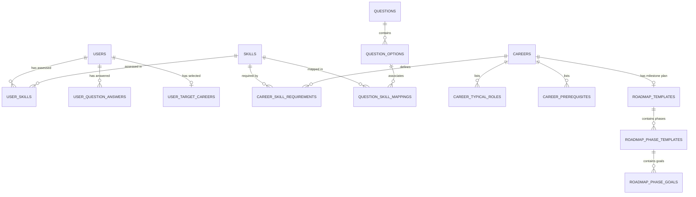
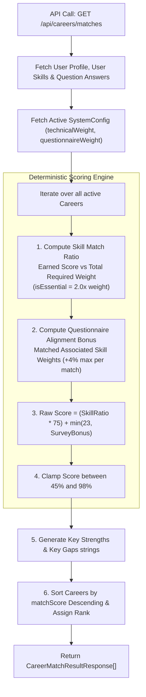
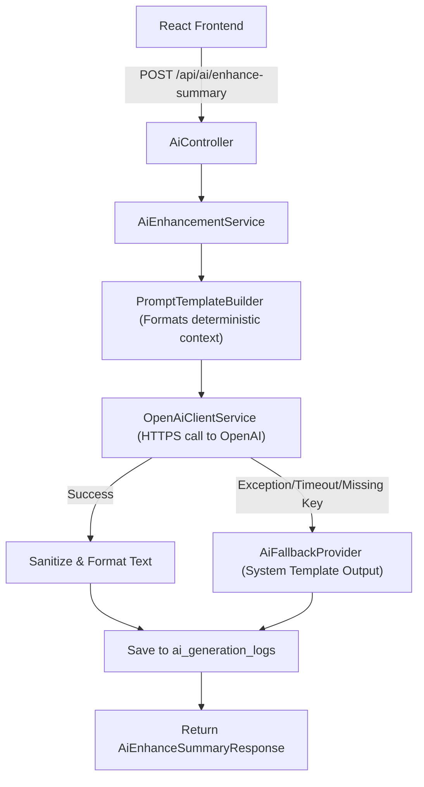

# SkillPilot Backend Architecture & API Contract Specification
**Phase 2: System Design & Technical Specification**
**Target Stack**: Java 21, Spring Boot 3.x, Spring Security, Spring Data JPA, MySQL 8.0, OpenAI API

---

## Executive Overview
This document specifies the authoritative backend architecture and API contract design for **SkillPilot**. It bridges the existing React 19 frontend UI with a production-grade Java Spring Boot backend and MySQL relational database.

### Source of Truth Alignment
1. **Business Rules & Scope**: Governed strictly by the approved SkillPilot SRS (excludes course recommendations, job matching, resume parsing, chatbots, and payments).
2. **Data Model & Contracts**: Governed by existing frontend TypeScript contracts (`Career`, `CareerMatchResult`, `SkillGapItem`, `CareerRoadmap`, `SystemConfig`, `UserProfile`) to ensure 100% frontend UI compatibility.
3. **Scoring & Decision Logic**: Governed by deterministic system algorithms migrated from `careerEngine.ts` to backend Spring services. AI is strictly isolated to narrative text formatting.

---

## 1. Spring Boot Package Structure

```
com.skillpilot
├── SkillPilotApplication.java
├── config
│   ├── ApplicationConfig.java
│   ├── SecurityConfig.java
│   ├── OpenAiConfig.java
│   └── CorsConfig.java
├── security
│   ├── JwtAuthenticationFilter.java
│   ├── JwtTokenProvider.java
│   ├── UserDetailsServiceImpl.java
│   └── SecurityUser.java
├── controller
│   ├── AuthController.java
│   ├── UserController.java
│   ├── QuestionnaireController.java
│   ├── CareerController.java
│   ├── SkillGapController.java
│   ├── RoadmapController.java
│   ├── AiController.java
│   └── AdminController.java
├── service
│   ├── AuthService.java
│   ├── UserService.java
│   ├── QuestionnaireService.java
│   ├── CareerService.java
│   ├── SkillGapService.java
│   ├── RoadmapService.java
│   ├── SystemConfigService.java
│   └── AiEnhancementService.java
├── scoring
│   ├── CareerScoringEngine.java
│   └── ScoringParameters.java
├── gapanalysis
│   └── SkillGapEvaluator.java
├── roadmap
│   └── RoadmapGenerator.java
├── ai
│   ├── OpenAiClientService.java
│   ├── PromptTemplateBuilder.java
│   └── AiFallbackProvider.java
├── repository
│   ├── UserRepository.java
│   ├── SkillRepository.java
│   ├── UserSkillRepository.java
│   ├── CareerRepository.java
│   ├── CareerSkillRequirementRepository.java
│   ├── QuestionRepository.java
│   ├── QuestionOptionRepository.java
│   ├── QuestionSkillMappingRepository.java
│   ├── UserQuestionAnswerRepository.java
│   ├── UserTargetCareerRepository.java
│   ├── RoadmapTemplateRepository.java
│   ├── SystemConfigRepository.java
│   └── AiGenerationLogRepository.java
├── entity
│   ├── User.java
│   ├── UserRole.java
│   ├── Skill.java
│   ├── SkillCategory.java
│   ├── UserSkill.java
│   ├── Career.java
│   ├── DemandLevel.java
│   ├── CareerSkillRequirement.java
│   ├── Question.java
│   ├── QuestionType.java
│   ├── QuestionOption.java
│   ├── QuestionSkillMapping.java
│   ├── UserQuestionAnswer.java
│   ├── UserTargetCareer.java
│   ├── RoadmapTemplate.java
│   ├── RoadmapPhaseTemplate.java
│   ├── SystemConfig.java
│   └── AiGenerationLog.java
├── dto
│   ├── request
│   │   ├── RegisterRequest.java
│   │   ├── LoginRequest.java
│   │   ├── ProfileUpdateRequest.java
│   │   ├── UserSkillUpdateRequest.java
│   │   ├── QuestionnaireAnswerSubmission.java
│   │   ├── TargetCareerSelectionRequest.java
│   │   ├── AiEnhanceSummaryRequest.java
│   │   ├── CareerCreateUpdateRequest.java
│   │   ├── QuestionCreateUpdateRequest.java
│   │   └── SystemConfigUpdateRequest.java
│   └── response
│       ├── AuthResponse.java
│       ├── UserProfileResponse.java
│       ├── UserSkillResponse.java
│       ├── QuestionItemResponse.java
│       ├── QuestionOptionResponse.java
│       ├── SkillRequirementResponse.java
│       ├── CareerResponse.java
│       ├── CareerMatchResultResponse.java
│       ├── SkillGapItemResponse.java
│       ├── SkillGapDiagnosticResponse.java
│       ├── RoadmapMilestoneResponse.java
│       ├── CareerRoadmapResponse.java
│       ├── AiEnhanceSummaryResponse.java
│       └── SystemConfigResponse.java
├── mapper
│   ├── UserMapper.java
│   ├── CareerMapper.java
│   ├── QuestionnaireMapper.java
│   └── RoadmapMapper.java
├── exception
│   ├── GlobalExceptionHandler.java
│   ├── ResourceNotFoundException.java
│   ├── BadRequestException.java
│   ├── UnauthorizedException.java
│   ├── DuplicateResourceException.java
│   └── ErrorResponse.java
└── validation
    ├── ValidPassword.java
    └── ValidPasswordValidator.java
```

---

## 2. Relational Database Schema Design (MySQL 8.0)

### 2.1 Schema Overview & Entity List
- `users`: Core user accounts and profile details.
- `skills`: Master taxonomy of technical, tool, domain, and soft skills.
- `user_skills`: User skill self-assessment ratings (0–5 scale).
- `careers`: Career track definitions.
- `career_skill_requirements`: Skill prerequisites and target levels per career.
- `career_typical_roles`: Collection table for typical job roles per career.
- `career_prerequisites`: Collection table for prerequisite knowledge per career.
- `questions`: Discovery questionnaire survey items.
- `question_options`: Selectable scenario options for questions.
- `question_skill_mappings`: Associated skill weighting per question option.
- `user_question_answers`: Stored survey responses per user.
- `user_target_careers`: Active selected target career track per user.
- `roadmap_templates`: Milestone phase definitions per career.
- `roadmap_phase_goals`: Collection table for milestone phase objectives.
- `system_configs`: Deterministic scoring weights and threshold configurations.
- `ai_generation_logs`: Audit log for OpenAI narrative enhancement requests.

---

### 2.2 Entity Field & DDL Specification

```sql
-- 1. SYSTEM CONFIGURATION
CREATE TABLE system_configs (
    id VARCHAR(36) PRIMARY KEY,
    technical_weight DECIMAL(4,3) NOT NULL DEFAULT 0.500,
    questionnaire_weight DECIMAL(4,3) NOT NULL DEFAULT 0.350,
    essential_skill_penalty DECIMAL(4,3) NOT NULL DEFAULT 0.150,
    minimum_match_threshold INT NOT NULL DEFAULT 40,
    is_active BOOLEAN NOT NULL DEFAULT TRUE,
    created_at TIMESTAMP NOT NULL DEFAULT CURRENT_TIMESTAMP,
    updated_at TIMESTAMP NOT NULL DEFAULT CURRENT_TIMESTAMP ON UPDATE CURRENT_TIMESTAMP,
    CONSTRAINT chk_tech_weight CHECK (technical_weight BETWEEN 0.0 AND 1.0),
    CONSTRAINT chk_quest_weight CHECK (questionnaire_weight BETWEEN 0.0 AND 1.0)
);

-- 2. USERS TABLE
CREATE TABLE users (
    id VARCHAR(36) PRIMARY KEY,
    name VARCHAR(100) NOT NULL,
    email VARCHAR(150) NOT NULL UNIQUE,
    password_hash VARCHAR(255) NOT NULL,
    role VARCHAR(20) NOT NULL DEFAULT 'student', -- 'student', 'admin'
    title VARCHAR(150) DEFAULT 'Student Profile',
    education VARCHAR(200) DEFAULT '',
    experience_years INT NOT NULL DEFAULT 0,
    location VARCHAR(100) DEFAULT '',
    target_focus VARCHAR(150) DEFAULT '',
    bio TEXT,
    completion_percentage INT NOT NULL DEFAULT 0,
    created_at TIMESTAMP NOT NULL DEFAULT CURRENT_TIMESTAMP,
    updated_at TIMESTAMP NOT NULL DEFAULT CURRENT_TIMESTAMP ON UPDATE CURRENT_TIMESTAMP,
    INDEX idx_users_email (email),
    INDEX idx_users_role (role)
);

-- 3. SKILLS MASTER DICTIONARY
CREATE TABLE skills (
    id VARCHAR(64) PRIMARY KEY, -- e.g. 'python', 'typescript'
    name VARCHAR(100) NOT NULL UNIQUE,
    category VARCHAR(50) NOT NULL, -- 'Technical', 'Tools & Frameworks', 'Domain Knowledge', 'Soft Skills'
    description TEXT,
    is_active BOOLEAN NOT NULL DEFAULT TRUE,
    created_at TIMESTAMP NOT NULL DEFAULT CURRENT_TIMESTAMP,
    updated_at TIMESTAMP NOT NULL DEFAULT CURRENT_TIMESTAMP ON UPDATE CURRENT_TIMESTAMP,
    INDEX idx_skills_category (category)
);

-- 4. USER SKILLS SELF-ASSESSMENT
CREATE TABLE user_skills (
    id VARCHAR(36) PRIMARY KEY,
    user_id VARCHAR(36) NOT NULL,
    skill_id VARCHAR(64) NOT NULL,
    level INT NOT NULL DEFAULT 0, -- 0 to 5
    created_at TIMESTAMP NOT NULL DEFAULT CURRENT_TIMESTAMP,
    updated_at TIMESTAMP NOT NULL DEFAULT CURRENT_TIMESTAMP ON UPDATE CURRENT_TIMESTAMP,
    CONSTRAINT fk_user_skills_user FOREIGN KEY (user_id) REFERENCES users(id) ON DELETE CASCADE,
    CONSTRAINT fk_user_skills_skill FOREIGN KEY (skill_id) REFERENCES skills(id) ON DELETE CASCADE,
    CONSTRAINT uq_user_skill UNIQUE (user_id, skill_id),
    CONSTRAINT chk_skill_level CHECK (level BETWEEN 0 AND 5)
);

-- 5. CAREERS TRACKS
CREATE TABLE careers (
    id VARCHAR(64) PRIMARY KEY, -- e.g. 'ai-software-engineer'
    title VARCHAR(150) NOT NULL UNIQUE,
    category VARCHAR(100) NOT NULL,
    description TEXT NOT NULL,
    average_salary VARCHAR(100) NOT NULL, -- e.g. "$145,000 - $190,000 / yr"
    growth_rate VARCHAR(100) NOT NULL,   -- e.g. "+32% (Very High Growth)"
    demand_level VARCHAR(20) NOT NULL,    -- 'High', 'Very High', 'Moderate'
    is_active BOOLEAN NOT NULL DEFAULT TRUE,
    created_at TIMESTAMP NOT NULL DEFAULT CURRENT_TIMESTAMP,
    updated_at TIMESTAMP NOT NULL DEFAULT CURRENT_TIMESTAMP ON UPDATE CURRENT_TIMESTAMP,
    INDEX idx_careers_category (category)
);

-- 5A. CAREER TYPICAL ROLES (Collection Table)
CREATE TABLE career_typical_roles (
    career_id VARCHAR(64) NOT NULL,
    role_name VARCHAR(150) NOT NULL,
    PRIMARY KEY (career_id, role_name),
    CONSTRAINT fk_roles_career FOREIGN KEY (career_id) REFERENCES careers(id) ON DELETE CASCADE
);

-- 5B. CAREER PREREQUISITES (Collection Table)
CREATE TABLE career_prerequisites (
    career_id VARCHAR(64) NOT NULL,
    prerequisite VARCHAR(200) NOT NULL,
    PRIMARY KEY (career_id, prerequisite),
    CONSTRAINT fk_prereq_career FOREIGN KEY (career_id) REFERENCES careers(id) ON DELETE CASCADE
);

-- 6. CAREER SKILL REQUIREMENTS
CREATE TABLE career_skill_requirements (
    id VARCHAR(36) PRIMARY KEY,
    career_id VARCHAR(64) NOT NULL,
    skill_id VARCHAR(64) NOT NULL,
    required_level INT NOT NULL DEFAULT 1, -- 1 to 5
    is_essential BOOLEAN NOT NULL DEFAULT FALSE,
    created_at TIMESTAMP NOT NULL DEFAULT CURRENT_TIMESTAMP,
    updated_at TIMESTAMP NOT NULL DEFAULT CURRENT_TIMESTAMP ON UPDATE CURRENT_TIMESTAMP,
    CONSTRAINT fk_csr_career FOREIGN KEY (career_id) REFERENCES careers(id) ON DELETE CASCADE,
    CONSTRAINT fk_csr_skill FOREIGN KEY (skill_id) REFERENCES skills(id) ON DELETE CASCADE,
    CONSTRAINT uq_career_skill UNIQUE (career_id, skill_id),
    CONSTRAINT chk_req_level CHECK (required_level BETWEEN 1 AND 5)
);

-- 7. QUESTIONNAIRE ITEMS
CREATE TABLE questions (
    id VARCHAR(64) PRIMARY KEY, -- e.g. 'q1'
    section VARCHAR(150) NOT NULL,
    question TEXT NOT NULL,
    description TEXT,
    type VARCHAR(20) NOT NULL, -- 'single', 'multiple', 'scale'
    display_order INT NOT NULL DEFAULT 0,
    is_active BOOLEAN NOT NULL DEFAULT TRUE,
    created_at TIMESTAMP NOT NULL DEFAULT CURRENT_TIMESTAMP,
    updated_at TIMESTAMP NOT NULL DEFAULT CURRENT_TIMESTAMP ON UPDATE CURRENT_TIMESTAMP
);

-- 8. QUESTION OPTIONS
CREATE TABLE question_options (
    id VARCHAR(64) PRIMARY KEY, -- e.g. 'q1-ai'
    question_id VARCHAR(64) NOT NULL,
    option_text TEXT NOT NULL,
    display_order INT NOT NULL DEFAULT 0,
    CONSTRAINT fk_options_question FOREIGN KEY (question_id) REFERENCES questions(id) ON DELETE CASCADE
);

-- 9. QUESTION OPTION SKILL MAPPINGS
CREATE TABLE question_skill_mappings (
    id VARCHAR(36) PRIMARY KEY,
    option_id VARCHAR(64) NOT NULL,
    skill_id VARCHAR(64) NOT NULL,
    weight INT NOT NULL DEFAULT 1, -- 1 to 5
    CONSTRAINT fk_qsm_option FOREIGN KEY (option_id) REFERENCES question_options(id) ON DELETE CASCADE,
    CONSTRAINT fk_qsm_skill FOREIGN KEY (skill_id) REFERENCES skills(id) ON DELETE CASCADE,
    CONSTRAINT uq_option_skill UNIQUE (option_id, skill_id)
);

-- 10. USER QUESTIONNAIRE ANSWERS
CREATE TABLE user_question_answers (
    id VARCHAR(36) PRIMARY KEY,
    user_id VARCHAR(36) NOT NULL,
    question_id VARCHAR(64) NOT NULL,
    selected_option_ids JSON NOT NULL, -- Array of selected option IDs e.g. ["q2-coding", "q2-architecture"]
    created_at TIMESTAMP NOT NULL DEFAULT CURRENT_TIMESTAMP,
    updated_at TIMESTAMP NOT NULL DEFAULT CURRENT_TIMESTAMP ON UPDATE CURRENT_TIMESTAMP,
    CONSTRAINT fk_uqa_user FOREIGN KEY (user_id) REFERENCES users(id) ON DELETE CASCADE,
    CONSTRAINT fk_uqa_question FOREIGN KEY (question_id) REFERENCES questions(id) ON DELETE CASCADE,
    CONSTRAINT uq_user_question UNIQUE (user_id, question_id)
);

-- 11. USER TARGET CAREER SELECTION
CREATE TABLE user_target_careers (
    id VARCHAR(36) PRIMARY KEY,
    user_id VARCHAR(36) NOT NULL UNIQUE,
    career_id VARCHAR(64) NOT NULL,
    selected_at TIMESTAMP NOT NULL DEFAULT CURRENT_TIMESTAMP,
    CONSTRAINT fk_utc_user FOREIGN KEY (user_id) REFERENCES users(id) ON DELETE CASCADE,
    CONSTRAINT fk_utc_career FOREIGN KEY (career_id) REFERENCES careers(id) ON DELETE CASCADE
);

-- 12. ROADMAP TEMPLATES
CREATE TABLE roadmap_templates (
    id VARCHAR(64) PRIMARY KEY, -- e.g. 'ai-software-engineer'
    career_id VARCHAR(64) NOT NULL UNIQUE,
    overall_timeline VARCHAR(100) NOT NULL, -- e.g. "6 Months (Phased 4-Stage Plan)"
    default_explanation TEXT NOT NULL,
    created_at TIMESTAMP NOT NULL DEFAULT CURRENT_TIMESTAMP,
    updated_at TIMESTAMP NOT NULL DEFAULT CURRENT_TIMESTAMP ON UPDATE CURRENT_TIMESTAMP,
    CONSTRAINT fk_rt_career FOREIGN KEY (career_id) REFERENCES careers(id) ON DELETE CASCADE
);

-- 13. ROADMAP PHASE TEMPLATES
CREATE TABLE roadmap_phase_templates (
    id VARCHAR(64) PRIMARY KEY, -- e.g. 'm1'
    roadmap_template_id VARCHAR(64) NOT NULL,
    phase_order INT NOT NULL DEFAULT 1,
    month_range VARCHAR(50) NOT NULL, -- e.g. "Months 1 – 2"
    phase_title VARCHAR(150) NOT NULL,
    focus_area VARCHAR(200) NOT NULL,
    expected_outcome TEXT NOT NULL,
    CONSTRAINT fk_rpt_template FOREIGN KEY (roadmap_template_id) REFERENCES roadmap_templates(id) ON DELETE CASCADE
);

-- 13A. ROADMAP PHASE GOALS (Collection Table)
CREATE TABLE roadmap_phase_goals (
    phase_id VARCHAR(64) NOT NULL,
    goal_text TEXT NOT NULL,
    goal_order INT NOT NULL DEFAULT 0,
    CONSTRAINT fk_rpg_phase FOREIGN KEY (phase_id) REFERENCES roadmap_phase_templates(id) ON DELETE CASCADE
);

-- 14. AI GENERATION AUDIT LOG
CREATE TABLE ai_generation_logs (
    id VARCHAR(36) PRIMARY KEY,
    user_id VARCHAR(36),
    career_id VARCHAR(64),
    prompt_text TEXT NOT NULL,
    response_text TEXT,
    status VARCHAR(20) NOT NULL, -- 'SUCCESS', 'FALLBACK', 'ERROR'
    source VARCHAR(50) NOT NULL, -- 'openai', 'system-calculated', 'fallback-template'
    created_at TIMESTAMP NOT NULL DEFAULT CURRENT_TIMESTAMP,
    CONSTRAINT fk_ai_user FOREIGN KEY (user_id) REFERENCES users(id) ON DELETE SET NULL
);
```

---

## 3. Entity Relationships & Structural Rationale



### Strategic Architectural Decisions:
1. **`User` Entity & Profile Alignment**:
   - `experienceYears` (int), `completionPercentage` (int), `title`, `education`, `targetFocus`, `bio` are directly stored on the `users` table, matching the frontend `UserProfile` interface cleanly without requiring join overhead.
2. **`Career` Rationale**:
   - Primary scalar fields (`title`, `category`, `description`, `averageSalary`, `growthRate`, `demandLevel`) are normalized directly on `careers`.
   - `typicalRoles` and `recommendedPrerequisites` use `@ElementCollection` child tables (`career_typical_roles`, `career_prerequisites`), offering clean relational integrity while producing exact JSON string arrays (`string[]`) for the frontend.
3. **`UserSkill` Scale (0–5)**:
   - Preserves the exact 0-to-5 level scale used in the frontend matrix (`0 = None`, `1 = Basic`, `2 = Elementary`, `3 = Intermediate`, `4 = Advanced`, `5 = Master`).
4. **`UserQuestionAnswer` JSON Storage**:
   - Uses MySQL `JSON` column for `selected_option_ids` (e.g. `["q2-coding", "q2-architecture"]`), seamlessly mapping both single-choice strings and multi-select arrays without artificial schema clutter.

---

## 4. Deterministic Business Logic & Scoring Architecture

All career scoring, ranking, skill-gap severity evaluation, readiness calculation, and roadmap milestone generation are **100% backend-controlled, deterministic operations**.



### 4.1 Exact Scoring Formula Specification (Migrated from `careerEngine.ts`)

For each `Career` record $C$:

1. **Required Skill Weight Calculation**:
   $$\text{Weight}(s) = \begin{cases} 2.0 & \text{if } s.\text{isEssential} = \text{true} \\ 1.0 & \text{if } s.\text{isEssential} = \text{false} \end{cases}$$
   $$\text{TotalRequiredWeight} = \sum_{s \in C.\text{requiredSkills}} (s.\text{requiredLevel} \times \text{Weight}(s))$$

2. **User Earned Score**:
   $$\text{UserLevel}(s) = \text{UserSkill.level for skill } s \text{ (or 0 if unassessed)}$$
   $$\text{EarnedScore} = \sum_{s \in C.\text{requiredSkills}} (\min(\text{UserLevel}(s), s.\text{requiredLevel}) \times \text{Weight}(s))$$
   $$\text{SkillMatchRatio} = \frac{\text{EarnedScore}}{\text{TotalRequiredWeight}}$$

3. **Questionnaire Survey Alignment Bonus**:
   $$\text{QuestionnaireBonus} = \sum_{q \in \text{UserAnswers}} \sum_{\text{opt} \in q.\text{selectedOptions}} \sum_{a \in \text{opt}.\text{associatedSkills}} \begin{cases} \left(\frac{a.\text{weight}}{5}\right) \times 4.0 & \text{if } a.\text{skillId} \in C.\text{requiredSkills} \\ 0 & \text{otherwise} \end{cases}$$

4. **Final Match Score Computation**:
   $$\text{RawScore} = \text{Math.round}\left( (\text{SkillMatchRatio} \times 75) + \min(23, \text{QuestionnaireBonus}) \right)$$
   $$\text{FinalMatchScore} = \max(45, \min(98, \text{RawScore}))$$

5. **Confidence Level Mapping**:
   $$\text{ConfidenceLevel} = \begin{cases} \text{"High"} & \text{if } \text{FinalMatchScore} \ge 85 \\ \text{"Medium"} & \text{if } 70 \le \text{FinalMatchScore} < 85 \\ \text{"Moderate"} & \text{if } \text{FinalMatchScore} < 70 \end{cases}$$

6. **Key Strengths & Key Gaps Generation**:
   - If $\text{UserLevel}(s) \ge s.\text{requiredLevel} \implies \text{Strength: } \text{"}s.\text{name (Level } \text{UserLevel}(s)/s.\text{requiredLevel)}"$.
   - If $\text{UserLevel}(s) < s.\text{requiredLevel} \implies \text{Gap: } \text{"}s.\text{name (Needs } +(s.\text{requiredLevel} - \text{UserLevel}(s)) \text{ level increase)}"$.

---

### 4.2 Skill Gap Diagnostic & Severity Logic
- **`gapAmount`** $= \max(0, s.\text{requiredLevel} - \text{UserLevel}(s))$
- **`severity` Rank**:
  - `gapAmount >= 3` $\implies$ `'critical'`
  - `gapAmount == 2` $\implies$ `'high'`
  - `gapAmount == 1` $\implies$ `'medium'`
  - `gapAmount == 0` $\implies$ `'low'` (Requirement Satisfied)
- **`recommendedAction`** (Deterministic Rules):
  - Category `'Technical'`: `"Complete hands-on coding modules & build portfolio projects in " + skillName`
  - Category `'Tools & Frameworks'`: `"Practice workflow integrations and environment setups for " + skillName`
  - Category `'Domain Knowledge'`: `"Read case studies and complete industry certification modules for " + skillName`
  - Category `'Soft Skills'`: `"Engage in peer reviews, presentations, and group problem-solving for " + skillName`
  - Satisfied (`gapAmount == 0`): `"Maintain skill practice."`

---

## 5. Security Architecture (Spring Security & JWT)

```mermaid
flowchart LR
    Client["React Frontend"] -- "Header: Authorization Bearer <token>" --> Filter["JwtAuthenticationFilter"]
    Filter -- "Extract & Validate Claims" --> Provider["JwtTokenProvider"]
    Provider -- "Load UserDetails" --> Service["UserDetailsServiceImpl"]
    Service -- "Set SecurityContext" --> Context["SecurityContextHolder"]
    Context --> Controller["Controller Layer"]
```



### 5.1 Security Specifications
- **Authentication**: Stateless JWT Authentication.
- **Token Claims**: Subject = `userId`, Custom Claims = `role` (`student` or `admin`), Expiration = 24 hours.
- **Password Encoder**: `BCryptPasswordEncoder` (strength 12).
- **Role-Based Access Control (RBAC)**:
  - Public Endpoints: `POST /api/auth/register`, `POST /api/auth/login`, `GET /api/health`
  - Student Endpoints (`ROLE_STUDENT` or `ROLE_ADMIN`): `/api/user/**`, `/api/questionnaire/**`, `/api/careers/**`, `/api/ai/**`
  - Admin Endpoints (`ROLE_ADMIN` ONLY): `/api/admin/**`
- **Ownership Verification**: User service verifies that `userId` in path/session matches `SecurityContextHolder.getContext().getAuthentication().getName()`.

---

## 6. AI Architecture & OpenAI Isolation



### 6.1 Strict AI Boundaries & Safeguards
1. **AI Scope**: AI is strictly used to improve narrative phrasing and readability of existing system reports.
2. **Prohibited Actions**: AI **NEVER** calculates match scores, ranks careers, determines skill gaps, evaluates gap severity, computes readiness ratios, or prioritizes roadmap milestones.
3. **Structured Prompt Framing**:
   ```
   System Instruction: You strictly enhance readability and phrasing for pre-calculated career analysis reports. Do not invent scores or alter system metrics.
   
   Context Provided:
   - Career Target: {careerTitle}
   - System Match Score: {currentMatchScore}%
   - Key Strengths Identified by System: {keyStrengths}
   - Key Skill Gaps Identified by System: {keyGaps}
   - User Goal: {targetRoleGoal}
   
   Output Format: Professional, supportive narrative summary in 2-3 concise sentences.
   ```
4. **Fallback Mechanism**: If the OpenAI API key is unconfigured, rate-limited, or throws an exception, `AiFallbackProvider` instantly returns a deterministic template string (`"System-Calculated Match (88%): Based on your profile assessment..."`) with `"source": "fallback-template"`.

---

## 7. SRS Compliance Strategy: Handling Frontend `recommendedCourses`

### Conflict Analysis
- **Existing UI Requirement**: The `RoadmapMilestone` interface in `types.ts` contains `recommendedCourses: string[]`.
- **Approved SRS Requirement**: The SRS explicitly excludes course recommendations, certification recommendations, job listings, and payments.

### Approved Handling Strategy
- **No Course Database**: We will **NOT** create a `courses` database table, course recommendation APIs, or third-party course search integrations.
- **Generic Topic Tags**: The backend `RoadmapGenerator` service will populate `recommendedCourses` with high-level conceptual study topic strings (e.g. `["Mastering Python Basics", "Industry Benchmark Foundations"]`) generated deterministically from the milestone's `focusArea`.
- **UI Compatibility**: The frontend receives `recommendedCourses: string[]` and renders topic chips as designed, achieving 100% UI component compatibility without violating the SRS scope.

---

## 8. Complete REST API Contract Specification

### 8.1 Authentication Endpoints

#### `POST /api/auth/register`
- **Purpose**: Creates a new student account and returns JWT token + profile.
- **Auth / Role**: Public
- **Request DTO (`RegisterRequest`)**:
  ```json
  {
    "name": "Alex Rivera",
    "email": "alex.rivera@university.edu",
    "password": "Password123",
    "education": "B.S. in Computer Science (Senior Year)",
    "targetFocus": "Artificial Intelligence"
  }
  ```
- **Validation**: `name` @NotBlank, `email` @Email @NotBlank, `password` @Pattern(min 8, 1 digit, 1 uppercase).
- **Response DTO (`AuthResponse`)**:
  ```json
  {
    "token": "eyJhbGciOi...",
    "userRole": "student",
    "userProfile": {
      "id": "usr-101",
      "name": "Alex Rivera",
      "email": "alex.rivera@university.edu",
      "title": "Student Profile",
      "education": "B.S. in Computer Science (Senior Year)",
      "experienceYears": 0,
      "location": "",
      "targetFocus": "Artificial Intelligence",
      "bio": "",
      "skills": [],
      "completionPercentage": 10
    }
  }
  ```
- **Errors**: `400 Bad Request` (validation failure), `409 Conflict` (email exists).

#### `POST /api/auth/login`
- **Purpose**: Authenticates user credentials and returns JWT token + role + profile.
- **Auth / Role**: Public
- **Request DTO (`LoginRequest`)**:
  ```json
  {
    "email": "alex.rivera@university.edu",
    "password": "password123"
  }
  ```
- **Response DTO (`AuthResponse`)**: Same as register response.
- **Errors**: `401 Unauthorized` (invalid credentials).

#### `GET /api/auth/me`
- **Purpose**: Fetches active authenticated user profile from JWT token.
- **Auth / Role**: Authenticated (`ROLE_STUDENT` or `ROLE_ADMIN`)
- **Response DTO (`UserProfileResponse`)**: Same as `userProfile` object.

---

### 8.2 User & Skill Assessment Endpoints

#### `GET /api/user/profile`
- **Purpose**: Retrieves full user profile including assessed skills.
- **Auth / Role**: Authenticated
- **Response DTO (`UserProfileResponse`)**:
  ```json
  {
    "id": "usr-101",
    "name": "Alex Rivera",
    "email": "alex.rivera@university.edu",
    "title": "Computer Science Undergraduate & Aspiring AI Engineer",
    "education": "B.S. in Computer Science (Senior Year)",
    "experienceYears": 1,
    "location": "San Francisco, CA",
    "targetFocus": "Artificial Intelligence & Machine Learning",
    "bio": "Passionate about leveraging software engineering principles...",
    "completionPercentage": 85,
    "skills": [
      { "skillId": "python", "name": "Python Programming", "category": "Technical", "level": 4 }
    ]
  }
  ```

#### `PUT /api/user/profile`
- **Purpose**: Updates user profile personal info fields.
- **Auth / Role**: Authenticated
- **Request DTO (`ProfileUpdateRequest`)**:
  ```json
  {
    "name": "Alex Rivera",
    "title": "Senior CS Major",
    "education": "B.S. Computer Science",
    "location": "San Francisco, CA",
    "targetFocus": "Artificial Intelligence",
    "bio": "Updated bio statement..."
  }
  ```
- **Response DTO**: Updated `UserProfileResponse`.

#### `PUT /api/user/skills`
- **Purpose**: Saves or updates a single skill self-assessment rating (0–5).
- **Auth / Role**: Authenticated
- **Request DTO (`UserSkillUpdateRequest`)**:
  ```json
  {
    "skillId": "python",
    "level": 4
  }
  ```
- **Validation**: `skillId` @NotBlank, `level` @Min(0) @Max(5).
- **Response DTO**:
  ```json
  {
    "skills": [ /* Array of UserSkillResponse */ ],
    "completionPercentage": 85
  }
  ```

---

### 8.3 Discovery Questionnaire Endpoints

#### `GET /api/questionnaire`
- **Purpose**: Returns active questionnaire items and options.
- **Auth / Role**: Authenticated
- **Response DTO**: `List<QuestionItemResponse>`
  ```json
  [
    {
      "id": "q1",
      "section": "Career Interests & Domain Focus",
      "question": "Which primary domain in technology aligns best with your professional curiosity?",
      "description": "Select the field where you find solving real-world problems most engaging.",
      "type": "single",
      "options": [
        {
          "id": "q1-ai",
          "text": "Artificial Intelligence, Machine Learning & Intelligent Automation",
          "associatedSkills": [
            { "skillId": "python", "weight": 4 }
          ]
        }
      ]
    }
  ]
  ```

#### `POST /api/questionnaire/answers`
- **Purpose**: Submits user questionnaire scenario responses and triggers match recalculation.
- **Auth / Role**: Authenticated
- **Request DTO (`QuestionnaireAnswerSubmission`)**:
  ```json
  {
    "answers": {
      "q1": "q1-ai",
      "q2": ["q2-coding", "q2-architecture"],
      "q3": "q3-2",
      "q4": "q4-med"
    }
  }
  ```
- **Response DTO**:
  ```json
  {
    "success": true,
    "message": "Questionnaire answers recorded successfully."
  }
  ```

---

### 8.4 Career & Ranking Endpoints

#### `GET /api/careers`
- **Purpose**: Returns all available active career tracks.
- **Auth / Role**: Authenticated
- **Response DTO**: `List<CareerResponse>`

#### `GET /api/careers/matches`
- **Purpose**: Calculates and returns deterministically ranked career matches for the user.
- **Auth / Role**: Authenticated
- **Response DTO**: `List<CareerMatchResultResponse>`
  ```json
  [
    {
      "career": {
        "id": "ai-software-engineer",
        "title": "AI & Machine Learning Engineer",
        "category": "Artificial Intelligence",
        "description": "Designs, builds, and deploys intelligent software systems...",
        "averageSalary": "$145,000 - $190,000 / yr",
        "growthRate": "+32% (Very High Growth)",
        "demandLevel": "Very High",
        "typicalRoles": ["AI Systems Engineer", "MLOps Specialist"],
        "recommendedPrerequisites": ["Computer Science Fundamentals"],
        "requiredSkills": [
          { "skillId": "python", "skillName": "Python Programming", "category": "Technical", "requiredLevel": 5, "isEssential": true }
        ]
      },
      "matchScore": 88,
      "keyStrengths": ["Python Programming (Level 4/5)"],
      "keyGaps": ["Deep Learning & PyTorch (Needs +2 level increase)"],
      "confidenceLevel": "High",
      "fitReason": "System calculated an 88% match due to strong proficiency...",
      "systemCalculatedBadge": "Deterministic Algorithm v2.4"
    }
  ]
  ```

#### `POST /api/user/target-career`
- **Purpose**: Sets active primary target career for the user.
- **Auth / Role**: Authenticated
- **Request DTO (`TargetCareerSelectionRequest`)**:
  ```json
  {
    "careerId": "ai-software-engineer"
  }
  ```
- **Response DTO**: `{ "selectedTargetCareer": { /* Career object */ } }`

---

### 8.5 Skill Gap & Roadmap Endpoints

#### `GET /api/user/skill-gap?careerId={careerId}`
- **Purpose**: Returns granular skill gap analysis matrix for specified target career.
- **Auth / Role**: Authenticated
- **Response DTO (`SkillGapDiagnosticResponse`)**:
  ```json
  {
    "careerId": "ai-software-engineer",
    "readinessRatio": 72,
    "skillGaps": [
      {
        "skillId": "deep-learning",
        "skillName": "Deep Learning & PyTorch",
        "category": "Technical",
        "currentLevel": 2,
        "requiredLevel": 4,
        "gapAmount": 2,
        "severity": "high",
        "isEssential": false,
        "recommendedAction": "Complete hands-on coding modules & build portfolio projects in Deep Learning & PyTorch."
      }
    ]
  }
  ```

#### `GET /api/user/roadmap?careerId={careerId}`
- **Purpose**: Returns phased milestone sequence for specified target career.
- **Auth / Role**: Authenticated
- **Response DTO (`CareerRoadmapResponse`)**:
  ```json
  {
    "careerId": "ai-software-engineer",
    "careerTitle": "AI & Machine Learning Engineer",
    "overallTimeline": "6 Months (Phased 4-Stage Plan)",
    "overallReadiness": 72,
    "aiExplanation": "System Calculated Summary: Milestone plan tailored for AI & Machine Learning Engineer...",
    "phases": [
      {
        "id": "phase-1",
        "monthRange": "Months 1 – 2",
        "phaseTitle": "Phase 1: Critical Skill Foundation",
        "focusArea": "Python Programming, Machine Learning & AI",
        "goals": [
          "Address critical gap in Python Programming (Target Level 5)"
        ],
        "expectedOutcome": "Achieve foundational competence in high-priority career requirements.",
        "recommendedCourses": [
          "Mastering Python Programming Basics",
          "Industry Benchmark Foundations"
        ],
        "status": "in_progress"
      }
    ]
  }
  ```

---

### 8.6 AI Wording Enhancer Endpoint

#### `POST /api/api/ai/enhance-summary` (Preserving Frontend URL Path)
- **Purpose**: Polishes readability of system-calculated roadmap narrative using OpenAI API.
- **Auth / Role**: Authenticated
- **Request DTO (`AiEnhanceSummaryRequest`)**:
  ```json
  {
    "careerTitle": "AI & Machine Learning Engineer",
    "currentMatchScore": 88,
    "keyStrengths": ["Python Programming"],
    "keyGaps": ["Deep Learning & PyTorch"],
    "targetRoleGoal": "Artificial Intelligence & Machine Learning"
  }
  ```
- **Response DTO (`AiEnhanceSummaryResponse`)**:
  ```json
  {
    "enhancedExplanation": "AI-Polished Narrative: Based on your profile assessment, your technical alignment is strong in Python Programming. Addressing Deep Learning & PyTorch will accelerate your career transition into AI & Machine Learning Engineer.",
    "source": "openai"
  }
  ```

---

### 8.7 Admin Dataset Endpoints (`ROLE_ADMIN` ONLY)

| HTTP Method | Endpoint | Purpose | Request DTO | Response DTO |
|---|---|---|---|---|
| `GET` | `/api/admin/careers` | Fetch all careers for admin grid | None | `List<CareerResponse>` |
| `POST` | `/api/admin/careers` | Create new career profile | `CareerCreateUpdateRequest` | `CareerResponse` |
| `PUT` | `/api/admin/careers/{id}` | Update existing career profile | `CareerCreateUpdateRequest` | `CareerResponse` |
| `DELETE` | `/api/admin/careers/{id}` | Delete career record | None | `204 No Content` |
| `GET` | `/api/admin/skills` | List master skills dictionary | None | `List<SkillResponse>` |
| `POST` | `/api/admin/skills` | Add new skill to dictionary | `SkillRequest` | `SkillResponse` |
| `GET` | `/api/admin/questionnaire` | Fetch questionnaire items | None | `List<QuestionItemResponse>` |
| `POST` | `/api/admin/questionnaire` | Add questionnaire survey item | `QuestionCreateUpdateRequest` | `QuestionItemResponse` |
| `DELETE` | `/api/admin/questionnaire/{id}` | Delete survey item | None | `204 No Content` |
| `GET` | `/api/admin/config` | Fetch active system algorithm weights | None | `SystemConfigResponse` |
| `PUT` | `/api/admin/config` | Update system algorithm weights | `SystemConfigUpdateRequest` | `SystemConfigResponse` |

---

## 9. Global Error Handling Architecture

A `@RestControllerAdvice` class (`GlobalExceptionHandler`) intercepts exceptions across controllers and maps them to standard `ErrorResponse` payloads matching frontend Toast notification expectations.

```json
{
  "timestamp": "2026-08-10T13:00:00Z",
  "status": 400,
  "error": "Bad Request",
  "message": "Validation failed for field 'level': Must be between 0 and 5",
  "path": "/api/user/skills",
  "details": ["level: Must be between 0 and 5"]
}
```

### Mapped Exception Hierarchy:
- `MethodArgumentNotValidException` $\implies$ `400 Bad Request`
- `ResourceNotFoundException` $\implies$ `404 Not Found`
- `UnauthorizedException` $\implies$ `401 Unauthorized`
- `AccessDeniedException` $\implies$ `403 Forbidden`
- `DuplicateResourceException` $\implies$ `409 Conflict`
- `Exception` (Unhandled) $\implies$ `500 Internal Server Error`

---

## 10. Express to Spring Boot Migration & Data Seed Strategy

### 10.1 Express Server Sunset Plan
1. **Current State**: Express (`server.ts`) handles `/api/health`, `/api/ai/enhance-summary` (Gemini API), and Vite SPA serving.
2. **Transition Strategy**:
   - Spring Boot runs on port `8080` (or `3000`).
   - Vite `vite.config.ts` configures dev proxy: `/api` $\to$ `http://localhost:8080`.
   - Once Spring Boot API endpoints pass verification, `server.ts` is retired.

### 10.2 Database Seeding (`data.sql`)
Upon application startup, `data.sql` executes if tables are empty, populating MySQL with:
- **`system_configs`**: `technical_weight=0.50`, `questionnaire_weight=0.35`, `essential_skill_penalty=0.15`.
- **`skills`**: 18 initial skills (`python`, `typescript`, `machine-learning`, `cloud-aws`, etc.).
- **`careers`**: 6 initial careers (`ai-software-engineer`, `cloud-architect`, `full-stack-developer`, etc.).
- **`questions`**: 4 initial questionnaire items (`q1` to `q4`) and option skill mappings.
- **`users`**: Seed admin account (`admin@skillpilot.edu`) and seed student account (`alex.rivera@university.edu`).
- **`roadmap_templates`**: Pre-configured milestone phases for career tracks.

---

## 11. Recommended Execution Order for Phase 3 (Implementation)

1. **Step 1**: Initialize Spring Boot 3.x Maven project structure (`com.skillpilot`).
2. **Step 2**: Configure `pom.xml` dependencies (Spring Web, Spring Security, Spring Data JPA, MySQL Driver, JJWT, Lombok, Jakarta Validation).
3. **Step 3**: Implement JPA Entity classes and repository interfaces.
4. **Step 4**: Create `schema.sql` and `data.sql` seeding scripts for MySQL database initialization.
5. **Step 5**: Implement Spring Security, JWT authentication provider, and auth endpoints.
6. **Step 6**: Implement deterministic `CareerScoringEngine`, `SkillGapEvaluator`, and `RoadmapGenerator` services.
7. **Step 7**: Implement REST controllers for User, Questionnaire, Careers, SkillGap, Roadmap, and Admin operations.
8. **Step 8**: Implement `OpenAiClientService` with fallback mechanism for `/api/ai/enhance-summary`.
9. **Step 9**: Configure Vite development proxy to point to Spring Boot backend.
10. **Step 10**: Verify end-to-end integration across all 10 React frontend screens.

---
*Specification Document Complete. Awaiting User Approval to Proceed to Phase 3.*
