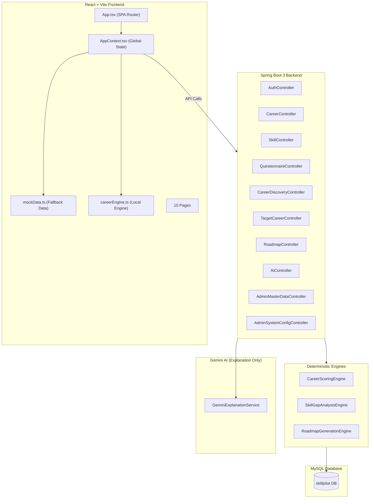
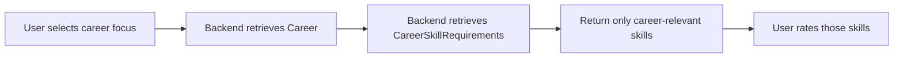
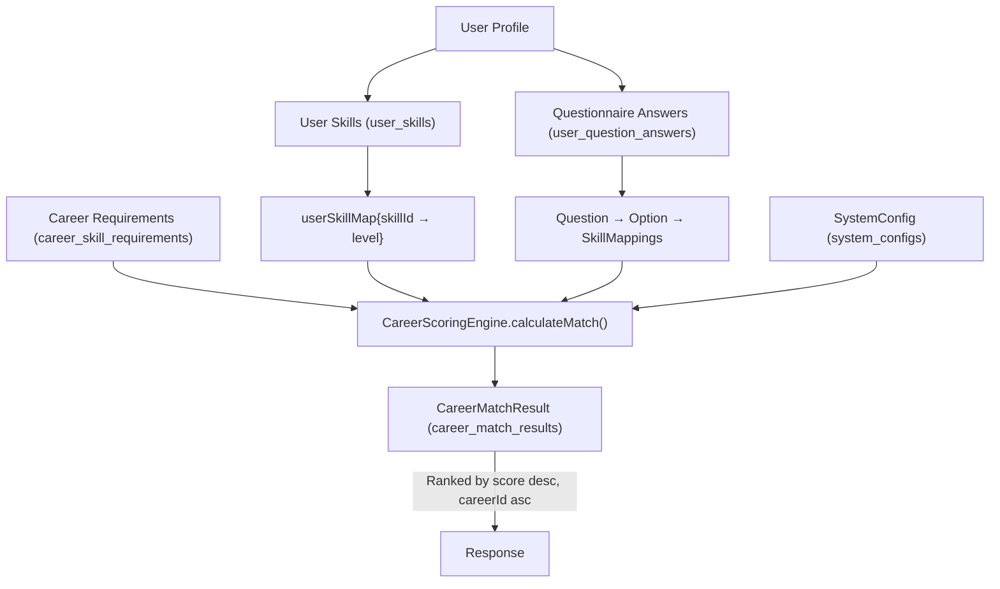
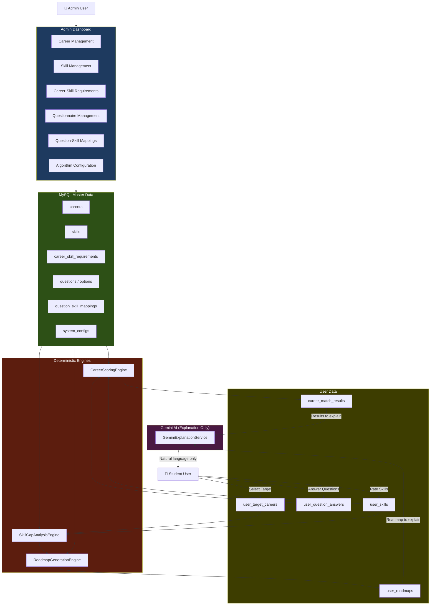

# SkillPilot — Deep System Analysis & Implementation Report

## A. Current System Understanding

### Architecture Overview



**Tech Stack:**
- **Frontend**: React 18 + TypeScript + Vite, single-page app with manual page routing via `activePage` state
- **Backend**: Spring Boot 3.x, Java 17+, JPA/Hibernate, Spring Security + JWT
- **Database**: MySQL 8.0 (local, `skillpilot` database)
- **AI**: Google Gemini API (disabled by default, explanation-only)

### Key Design Pattern
The frontend uses a **dual-source architecture**: hardcoded `mockData.ts` arrays serve as initial state, then API calls to Spring Boot overwrite them on startup. When authenticated, backend data is authoritative; for guests, local `careerEngine.ts` provides preview calculations.

---

## B. Current Database Inventory (Live MySQL Data)

| Entity | Table | Count | Notes |
|--------|-------|-------|-------|
| Careers | `careers` | **17** | 11 active, 6 inactive (test "Quantum Computing" duplicates) |
| Skills | `skills` | **33** | 27 active, 6 inactive (test "Quantum Physics" duplicates) |
| Career-Skill Requirements | `career_skill_requirements` | **31** | Only 6 of 11 active careers have requirements |
| Questions | `questions` | **4** | All active |
| Question Options | `question_options` | **15** | Across 4 questions |
| Question-Skill Mappings | `question_skill_mappings` | **34** | All mapped to IT-related skills |
| Users | `users` | **8** | 4 ADMIN, 4 STUDENT |
| User Skills | `user_skills` | **0** | No user has rated any skills |
| User Question Answers | `user_question_answers` | **0** | No saved questionnaire answers |
| Career Match Results | `career_match_results` | **11** | All for "Student Audit" user, all score 45 (minimum) |
| User Target Careers | `user_target_careers` | **1** | Student Audit → AI & ML Engineer |
| Roadmaps | `user_roadmaps` | **1** | Student Audit, readiness 0 |
| Roadmap Milestones | `user_roadmap_milestones` | **4** | 4 phases for the single roadmap |
| System Configs | `system_configs` | **1** | Active, tech_weight=0.600 |
| AI Generation Logs | `ai_generation_logs` | **0** | Gemini disabled |
| Roadmap Templates | `roadmap_templates` | **1** | AI & ML Engineer only |
| Roadmap Phase Templates | `roadmap_phase_templates` | **4** | 4 phases for AI career |

### Active Careers with Skill Requirements

| Career | Required Skills |
|--------|----------------|
| AI & Machine Learning Engineer | 6 (Python L5, ML L4, DL L4, Cloud L3, Docker L3, Problem-Solving L4) |
| Cloud Solutions Architect | 6 (Cloud L5, SysDesign L4, Docker L4, Terraform L4, Security L3, Communication L4) |
| Senior Full-Stack Engineer | 5 (TypeScript L5, React L4, SQL L4, Git L3, Problem-Solving L4) |
| Lead Data Scientist | 5 (Python L4, Data-Viz L5, SQL L4, ML L3, Communication L4) |
| Cybersecurity & InfoSec Officer | 4 (Security L5, Cloud L3, Python L3, Problem-Solving L5) |
| Technical Product Manager | 5 (Product-Mgmt L5, Agile L4, Communication L5, UX L3, Data-Viz L3) |

> [!CAUTION]
> ### 5 Active Careers Have ZERO Skill Requirements in the Database
> - Clinical Operations Lead & Healthcare Director
> - Senior Financial Analyst & Investment Strategist
> - Renewable Energy & Clean Tech Systems Engineer
> - Digital Marketing & Growth Strategy Director
> - Lead Product UI/UX Designer
>
> These careers exist in the `mockData.ts` frontend file with hardcoded `requiredSkills`, but the database `career_skill_requirements` table has **no corresponding rows**. This means the backend scoring engine will calculate a 0% skill match ratio for these careers, resulting in the minimum 45% score for all users.

### Orphaned / Suspicious Records

| Issue | Details |
|-------|---------|
| **6 inactive "Quantum Computing" careers** | UUIDs suggest they were created via test API calls and soft-deleted. No impact on scoring but clutter the admin view. |
| **6 inactive "Quantum Physics" skills** | Same test pattern. No career requirements reference them. |
| **Match results all 45%** | Student Audit has 0 skills and 0 answers, so all 11 career matches hit the minimum score floor. This is correct behavior. |
| **System config tech_weight = 0.600** | Differs from entity default (0.500). Someone updated it via admin API. |
| **Questionnaire questions are IT-only** | Q1 options cover only AI/Cloud/Web/Data/Security — no options for Healthcare, Finance, Energy, Marketing, or Design careers. |

---

## C. Current Admin Capabilities (Already Implemented)

### Backend APIs (All require ADMIN role)

| Capability | Endpoint | Status |
|------------|----------|--------|
| List all careers (incl. inactive) | `GET /api/admin/careers` | ✅ Working |
| Create career | `POST /api/admin/careers` | ✅ Working |
| Update career | `PUT /api/admin/careers/{id}` | ✅ Working |
| Delete career (soft) | `DELETE /api/admin/careers/{id}` | ✅ Working |
| Add career-skill requirement | `POST /api/admin/careers/{id}/requirements` | ✅ Working |
| Update requirement | `PUT /api/admin/career-requirements/{id}` | ✅ Working |
| Delete requirement | `DELETE /api/admin/career-requirements/{id}` | ✅ Working |
| List all skills (incl. inactive) | `GET /api/admin/skills` | ✅ Working |
| Create skill | `POST /api/admin/skills` | ✅ Working |
| Update skill | `PUT /api/admin/skills/{id}` | ✅ Working |
| Delete skill (soft) | `DELETE /api/admin/skills/{id}` | ✅ Working |
| List all questions | `GET /api/admin/questionnaire` | ✅ Working |
| Create question | `POST /api/admin/questionnaire` | ✅ Working |
| Update question | `PUT /api/admin/questionnaire/{id}` | ✅ Working |
| Delete question (soft) | `DELETE /api/admin/questionnaire/{id}` | ✅ Working |
| Create option | `POST /api/admin/questions/{qId}/options` | ✅ Working |
| Update option | `PUT /api/admin/question-options/{id}` | ✅ Working |
| Delete option | `DELETE /api/admin/question-options/{id}` | ✅ Working |
| Get system config | `GET /api/admin/config` | ✅ Working |
| Update system config | `PUT /api/admin/config` | ✅ Working |
| Get dashboard stats | `GET /api/admin/stats` | ✅ Working |

### Frontend Admin Dashboard ([AdminDashboardPage.tsx](file:///c:/Users/USER/Downloads/skillpilot/frontend/src/pages/AdminDashboardPage.tsx))

The admin dashboard already implements:
- Dashboard statistics display
- Career CRUD with forms
- Skill listing
- Questionnaire management
- System config editing (weights, threshold)

---

## D. Missing Admin Capabilities

| Missing Feature | Priority | Notes |
|-----------------|----------|-------|
| **Career-skill requirement management UI** | 🔴 Critical | Backend API exists but admin UI does not show/edit career-skill mappings |
| **Question-skill mapping management** | 🔴 Critical | No admin API or UI for creating/editing `QuestionSkillMapping` records |
| **Career-specific question association** | 🔴 Critical | No mechanism exists to associate questions with specific careers |
| **Skill reactivation UI** | 🟡 Medium | Delete = soft deactivation, but no explicit reactivate button |
| **Career reactivation UI** | 🟡 Medium | Same issue |
| **Admin search/filter** | 🟡 Medium | Career and skill lists have no search capability |
| **Config version history** | 🟡 Medium | Config is mutated in-place with no audit trail |
| **Bulk career-skill import** | 🟢 Low | Would speed up initial data population |
| **Dashboard - mapping counts** | 🟢 Low | Stats don't show career-skill requirements count or question-skill mapping count |

---

## E. Career → Skill Architecture

### Current State

The data model correctly supports career-specific skills:

```
Career (1) ──→ (N) CareerSkillRequirement ──→ (1) Skill
                    ├── required_level (1-5)
                    └── is_essential (boolean)
```

**Unique constraint**: `uq_career_skill` on `(career_id, skill_id)` prevents duplicates.

### How Career-Specific Skills Should Work for Users



### Required Changes

#### New API Endpoint Needed

| Method | Endpoint | Purpose |
|--------|----------|---------|
| `GET` | `/api/careers/{careerId}/skills` | Returns skills relevant to a career with required levels |

This endpoint should:
1. Look up `CareerSkillRequirement` by `careerId`
2. Return skills with `requiredLevel` and `isEssential` metadata
3. Be authenticated (user must be logged in)
4. Filter out inactive skills

**No new table needed** — the `career_skill_requirements` table already contains all necessary data.

#### Frontend Changes

Currently, [ProfilePage.tsx](file:///c:/Users/USER/Downloads/skillpilot/frontend/src/pages/ProfilePage.tsx) shows ALL skills from `skillsList` for rating. This should be changed to show only career-relevant skills when a user has a target career or career focus selected.

The `skillsList` state in [AppContext.tsx](file:///c:/Users/USER/Downloads/skillpilot/frontend/src/context/AppContext.tsx) is initialized from `INITIAL_SKILLS` (27 hardcoded skills) and then overwritten by `GET /api/skills` (33 active DB skills). **All skills are shown to every user regardless of career.**

---

## F. Career → Questionnaire Architecture

### Current State

The `Question` entity has **no career association**. All questions are generic:
- Q1: "Which primary domain in technology aligns best?" — 5 options (AI, Cloud, Web, Data, Security)
- Q2: "What type of problem-solving activities?" — 4 options (Coding, Architecture, People, Data)
- Q3: "Coding comfort level?" — 3 options (Beginner/Intermediate/Advanced)
- Q4: "Weekly hours for development?" — 3 options (5-10, 10-20, 20+)

Questions link to skills only through `QuestionOption → QuestionSkillMapping → Skill`, **not through careers**.

### Proposed Architecture (Least Disruptive)

**Option: Question → multiple Careers (via join table)**

```
Question (N) ──→ (M) Career  (via question_career_associations)
```

**Rationale**: A question like "How comfortable are you with Python?" is relevant to multiple careers (AI Engineer, Data Scientist, Full-Stack). This is the most flexible and maintainable approach.

**Alternative (through existing data)**: Since questions map to skills via `QuestionSkillMapping`, and skills map to careers via `CareerSkillRequirement`, we can derive career-relevance without a new table:

```
Question → Options → QuestionSkillMapping → Skill → CareerSkillRequirement → Career
```

**Recommendation**: Use the **derived relationship** approach first (no schema change) by computing career-relevant questions at query time. Only add an explicit join table if performance becomes an issue or if admins need to override the derived association.

#### Derived Query Logic
```sql
SELECT DISTINCT q.* FROM questions q
JOIN question_options qo ON qo.question_id = q.id
JOIN question_skill_mappings qsm ON qsm.option_id = qo.id
JOIN career_skill_requirements csr ON csr.skill_id = qsm.skill_id
WHERE csr.career_id = :careerId AND q.is_active = true
ORDER BY q.display_order
```

### API Endpoint Needed

| Method | Endpoint | Purpose |
|--------|----------|---------|
| `GET` | `/api/questionnaire/career/{careerId}` | Returns questions relevant to a career |

> [!IMPORTANT]
> The current questionnaire has **no options for non-IT careers**. Q1 only covers AI/Cloud/Web/Data/Security. Healthcare, Finance, Energy, Marketing, and Design careers have zero questionnaire coverage. New questions and options must be created by administrators for these career domains.

---

## G. Algorithm Configuration

### Currently Configurable Values (in `system_configs` table)

| Parameter | Current Value | Default | Used By | Valid Range |
|-----------|--------------|---------|---------|-------------|
| `technical_weight` | 0.600 | 0.500 | CareerScoringEngine: `techScale = value × 150.0` | 0.000 - 1.000 |
| `questionnaire_weight` | 0.350 | 0.350 | CareerScoringEngine: `questCap = value × 65.714` | 0.000 - 1.000 |
| `essential_skill_penalty` | 0.150 | 0.150 | **NOT USED** in any engine | N/A |
| `minimum_match_threshold` | 40 | 45 | CareerScoringEngine: floor for raw score | 0 - 100 |

> [!WARNING]
> **`essential_skill_penalty` (0.150) is defined in the schema and stored in the database but is NEVER consumed by any engine.** The `CareerScoringEngine` uses a hardcoded weight of `2.0` for essential skills and `1.0` for non-essential — this value does not come from `SystemConfig`.

### Values That Should Be Configurable But Are Currently Hardcoded

| Value | Location | Current | Should Be |
|-------|----------|---------|-----------|
| Essential skill weight multiplier | `CareerScoringEngine` L64 | `2.0` hardcoded | Configurable via `essential_skill_penalty` or new field |
| Score ceiling | `CareerScoringEngine` L129 | `98` hardcoded | Configurable |
| Skill gap severity thresholds | `SkillGapAnalysisEngine` L59-67 | `≥3=critical, 2=high, 1=medium` | Configurable |
| Roadmap duration range | `RoadmapService` L36-37 | `6-12 months` | Configurable |
| Scoring version string | Multiple locations | `"v2.4"` hardcoded | Should be derived from config version |

---

## H. Career Scoring Engine

### Exact Current Formula

```
For each career:
  For each CareerSkillRequirement:
    weight = isEssential ? 2.0 : 1.0
    totalRequiredWeight += requiredLevel × weight
    scoreForSkill = min(userLevel, requiredLevel) × weight
    earnedScore += scoreForSkill

  skillMatchRatio = earnedScore / totalRequiredWeight

  questionnaireBonus = 0
  For each user answer:
    For each selected option:
      For each option's skill mapping:
        if mappedSkill is in career's required skills:
          questionnaireBonus += (mapping.weight / 5.0) × 4.0

  rawPercentage = round(skillMatchRatio × techScale + min(questCap, questionnaireBonus))
  clamp rawPercentage to [45, 98]

  confidenceLevel = score≥85 → "High", ≥70 → "Medium", else → "Moderate"
```

Where:
- `techScale = SystemConfig.technicalWeight × 150.0` (default 75.0)
- `questCap = SystemConfig.questionnaireWeight × 65.714` (default 23.0)

### Data Flow



### Historical Result Persistence
- Results are stored in `career_match_results` with `scoring_version = "v2.4"`
- Existing results are **updated in-place** (upsert by `user_id + career_id`)
- **No historical snapshot is preserved** — old scores are silently overwritten

---

## I. Skill Gap Engine

### Exact Current Formula

```
For each CareerSkillRequirement in target career:
  gapAmount = max(0, requiredLevel - currentLevel)
  weight = isEssential ? 2.0 : 1.0
  fulfillment = min(1.0, currentLevel / requiredLevel)
  totalWeightedFulfillment += fulfillment × weight
  totalWeight += weight

  severity:
    gap ≥ 3 → "critical"
    gap = 2 → "high"
    gap = 1 → "medium"
    gap = 0 → "low"

readinessScore = round((totalWeightedFulfillment / totalWeight) × 100)
clamp to [0, 100]
```

### Sorting
Skills are sorted by: severity descending → skillId ascending

### Dependencies
- `Career.requiredSkills` (CareerSkillRequirement)
- `UserSkill.level` for each user-skill pair
- No configuration values — all thresholds are hardcoded

---

## J. Readiness Engine

Readiness is calculated **within** the SkillGapAnalysisEngine as `readinessScore` — it is not a separate engine.

**Formula**: Weighted fulfillment ratio where essential skills count 2× and non-essential count 1×.

A career with no requirements returns 100% readiness.

---

## K. Roadmap Engine

### Current Logic

The `RoadmapGenerationEngine` generates a fixed **4-phase roadmap**:

1. **Phase 1**: Focus on critical/high gaps
2. **Phase 2**: Focus on medium/low gaps (or template defaults)
3. **Phase 3**: Template or hardcoded "Production Hardening"
4. **Phase 4**: Template or hardcoded "Portfolio Defense"

### Phase Duration Calculation
```
Total duration split into 4 quarters:
q1End = max(1, duration/4)
q2End = max(q1End+1, duration/2)
q3End = max(q2End+1, 3×duration/4)
q4End = duration
```

### Template System
- `RoadmapTemplate` (1-to-1 with Career) provides default timeline and explanation
- `RoadmapPhaseTemplate` provides per-phase defaults (title, focus, goals, outcome)
- Only 1 template exists: AI & ML Engineer
- Templates are used as fallback when gap-driven content is empty

### Persistence
- Roadmap is upserted by `user_id + career_id`
- Old milestones are **deleted and replaced** (orphanRemoval)
- No historical versioning of roadmaps

---

## L. Historical Data Strategy

### Current Problems

| Issue | Severity |
|-------|----------|
| Career match results are updated in-place | 🔴 Critical |
| No scoring configuration snapshot stored with results | 🔴 Critical |
| No career requirement snapshot stored with results | 🔴 Critical |
| Roadmap milestones are deleted and replaced on regeneration | 🟡 High |
| `scoring_version` is hardcoded "v2.4", not derived from config | 🟡 High |

### Proposed Minimum Schema Changes

1. **Add `config_snapshot_json` column to `career_match_results`**: Store the SystemConfig values used at calculation time
2. **Add `requirements_snapshot_json` column to `career_match_results`**: Store the career requirements used
3. **Add `scoring_version` auto-increment or timestamp**: Derive from config update timestamp instead of hardcoded string
4. **Add `generation_context_json` column to `user_roadmaps`**: Store the skill gap and config snapshot used to generate the roadmap
5. **Consider making roadmaps immutable**: Create new roadmaps instead of updating. Add `is_current` flag.

---

## M. API Changes Required

### New Endpoints

| Method | Endpoint | Auth | Role | Purpose | Tables |
|--------|----------|------|------|---------|--------|
| `GET` | `/api/careers/{id}/skills` | Yes | Any | Get career-specific skills for user rating | `career_skill_requirements`, `skills` |
| `GET` | `/api/questionnaire/career/{id}` | Yes | Any | Get career-relevant questions | Derived from `question_skill_mappings` + `career_skill_requirements` |
| `POST` | `/api/admin/question-skill-mappings` | Yes | ADMIN | Create question-option → skill mapping | `question_skill_mappings` |
| `PUT` | `/api/admin/question-skill-mappings/{id}` | Yes | ADMIN | Update mapping weight | `question_skill_mappings` |
| `DELETE` | `/api/admin/question-skill-mappings/{id}` | Yes | ADMIN | Delete mapping | `question_skill_mappings` |
| `PUT` | `/api/admin/careers/{id}/activate` | Yes | ADMIN | Reactivate a deactivated career | `careers` |
| `PUT` | `/api/admin/skills/{id}/activate` | Yes | ADMIN | Reactivate a deactivated skill | `skills` |

### Existing Endpoints to Extend

| Endpoint | Change |
|----------|--------|
| `GET /api/admin/stats` | Add `careerSkillMappingCount`, `questionSkillMappingCount` |
| `GET /api/admin/careers` | Add search/filter query params (`?search=`, `?active=`) |
| `GET /api/admin/skills` | Add search/filter query params |
| `GET /api/admin/questionnaire` | Return career associations if implemented |

---

## N. Database Changes Required

### Schema Changes

| Table | Change | Reason | Migration Strategy |
|-------|--------|--------|-------------------|
| `career_match_results` | Add `config_snapshot` TEXT | Historical config preservation | ALTER TABLE ADD, default NULL for existing rows |
| `career_match_results` | Add `requirements_snapshot` TEXT | Historical requirement preservation | ALTER TABLE ADD, default NULL |
| `user_roadmaps` | Add `generation_context` TEXT | Historical generation preservation | ALTER TABLE ADD, default NULL |
| `questions` | **Optional**: Add `question_career_associations` join table | Career-specific questionnaire | New table, no existing data impact |
| `question_skill_mappings` | No change needed | Existing structure sufficient | N/A |

### Missing Career-Skill Requirements (Data Fix)

The following 5 active careers need `career_skill_requirements` rows seeded to match the `mockData.ts` definitions:

1. **Clinical Operations Lead**: Patient-Care L5(E), Medical-Compliance L4(E), Communication L5(E), Problem-Solving L4(E)
2. **Financial Analyst**: Financial-Modeling L5(E), Corporate-Finance L4(E), Data-Analytics L4(E), Communication L4(E)
3. **Clean Tech Engineer**: Clean-Energy L5(E), CAD-Engineering L4(E), Problem-Solving L5(E)
4. **Digital Marketing Director**: Digital-Marketing L5(E), Brand-Strategy L4(E), Data-Analytics L4(E), Communication L5(E)
5. **UI/UX Design Lead**: Figma-UI L5(E), UX-Design L5(E), Communication L4(E)

---

## O. Frontend Changes Required

### Pages Requiring Changes

| Page | Change | Priority |
|------|--------|----------|
| [ProfilePage.tsx](file:///c:/Users/USER/Downloads/skillpilot/frontend/src/pages/ProfilePage.tsx) | Show career-specific skills instead of all skills | 🔴 Critical |
| [QuestionnairePage.tsx](file:///c:/Users/USER/Downloads/skillpilot/frontend/src/pages/QuestionnairePage.tsx) | Fetch career-specific questions instead of all questions | 🔴 Critical |
| [AdminDashboardPage.tsx](file:///c:/Users/USER/Downloads/skillpilot/frontend/src/pages/AdminDashboardPage.tsx) | Add career-skill requirement management UI | 🔴 Critical |
| [AdminDashboardPage.tsx](file:///c:/Users/USER/Downloads/skillpilot/frontend/src/pages/AdminDashboardPage.tsx) | Add question-skill mapping management UI | 🟡 High |
| [AppContext.tsx](file:///c:/Users/USER/Downloads/skillpilot/frontend/src/context/AppContext.tsx) | Remove `mockData.ts` fallback initialization | 🟡 High |
| [AppContext.tsx](file:///c:/Users/USER/Downloads/skillpilot/frontend/src/context/AppContext.tsx) | Remove local `careerEngine.ts` usage for authenticated users | 🟡 High |

### Hardcoded Data That Must Be Removed

| File | Constant | Usage | Replacement |
|------|----------|-------|-------------|
| [mockData.ts](file:///c:/Users/USER/Downloads/skillpilot/frontend/src/data/mockData.ts) | `INITIAL_CAREERS` | Fallback initial state for `careers` | Empty array `[]`, load from API |
| [mockData.ts](file:///c:/Users/USER/Downloads/skillpilot/frontend/src/data/mockData.ts) | `INITIAL_SKILLS` | Fallback initial state for `skillsList` | Empty array `[]`, load from API |
| [mockData.ts](file:///c:/Users/USER/Downloads/skillpilot/frontend/src/data/mockData.ts) | `INITIAL_QUESTIONNAIRE` | Fallback initial state for `questionnaire` | Empty array `[]`, load from API |
| [mockData.ts](file:///c:/Users/USER/Downloads/skillpilot/frontend/src/data/mockData.ts) | `MOCK_USER_PROFILE` | Not used in AppContext (unused export) | Delete |
| [mockData.ts](file:///c:/Users/USER/Downloads/skillpilot/frontend/src/data/mockData.ts) | `SAMPLE_ROADMAPS` | Not used in AppContext (unused export) | Delete |
| [mockData.ts](file:///c:/Users/USER/Downloads/skillpilot/frontend/src/data/mockData.ts) | `DEFAULT_SYSTEM_CONFIG` | Initial state for `systemConfig` | Load from API |
| [careerEngine.ts](file:///c:/Users/USER/Downloads/skillpilot/frontend/src/utils/careerEngine.ts) | `calculateCareerMatch()` | Guest fallback scoring | Keep for guest preview only |
| [careerEngine.ts](file:///c:/Users/USER/Downloads/skillpilot/frontend/src/utils/careerEngine.ts) | `generateRoadmapForCareer()` | Guest fallback roadmap | Keep for guest preview only |

---

## P. Security Analysis

### Current Security Model

| Layer | Implementation | Status |
|-------|---------------|--------|
| Authentication | JWT via `JwtAuthenticationFilter` | ✅ Solid |
| Admin authorization | `@PreAuthorize("hasRole('ADMIN')")` on controller class | ✅ Server-side enforced |
| User data isolation | `@AuthenticationPrincipal SecurityUser` extracts userId from JWT | ✅ Correct |
| CORS | Configured for `FRONTEND_ORIGIN` | ✅ Configured |
| Password hashing | BCrypt with strength 12 | ✅ Strong |
| Public endpoints | Careers, Skills, Questionnaire, Health, AI endpoints are public GET | ⚠️ AI endpoints are fully public (no auth required) |

### Security Gaps

| Issue | Severity |
|-------|----------|
| AI endpoints (`/api/ai/**`) are `permitAll()` — anyone can call Gemini without authentication | 🟡 Medium (Gemini is disabled, but if enabled, this is a cost risk) |
| `AdminTestController` exists but is empty (file is 796 bytes) — should be removed in production | 🟢 Low |
| JWT secret is a long string in `.env` but is a dev-only static key | 🟡 Medium (production concern) |
| No rate limiting on any endpoint | 🟡 Medium |
| `QuestionnaireController.getActiveQuestionnaire()` is public — questions are readable by unauthenticated users | ⚠️ By design for guest preview |

### Ownership Verification

All user-data endpoints correctly extract `userId` from the JWT `SecurityUser` principal. No endpoint accepts a raw userId parameter that could be spoofed. The `RoadmapService.getRoadmapById()` correctly verifies ownership before returning data.

---

## Q. Problems Found

### 🔴 Critical

| # | Problem | Location | Impact |
|---|---------|----------|--------|
| C1 | **5 active careers have zero skill requirements in DB** | `career_skill_requirements` table | Scoring engine returns minimum score (45%) for these careers for all users |
| C2 | **Questionnaire covers only IT careers** | Q1 options in `question_options` | Non-IT career scoring gets zero questionnaire bonus |
| C3 | **Frontend initialized with hardcoded mock data** | [AppContext.tsx L109-112](file:///c:/Users/USER/Downloads/skillpilot/frontend/src/context/AppContext.tsx#L109-L112) | If API fails, users see stale data that doesn't match the database |
| C4 | **Career match results are updated in-place** | [CareerDiscoveryService L78-94](file:///c:/Users/USER/Downloads/skillpilot/backend/src/main/java/com/skillpilot/service/CareerDiscoveryService.java#L78-L94) | Historical scores are lost when admin changes config or requirements |
| C5 | **All skills shown to all users** | ProfilePage, AppContext | Users rate irrelevant skills, diluting self-assessment quality |

### 🟡 High

| # | Problem | Location | Impact |
|---|---------|----------|--------|
| H1 | **`essential_skill_penalty` config value is never used** | [CareerScoringEngine](file:///c:/Users/USER/Downloads/skillpilot/backend/src/main/java/com/skillpilot/service/CareerScoringEngine.java) | Admin edits this value expecting it to affect scoring, but it's ignored |
| H2 | **No admin UI for career-skill requirement management** | AdminDashboardPage | Admins cannot configure the most critical data relationship |
| H3 | **No admin API for question-skill mappings** | Backend controllers | Admins cannot create/edit question-option-to-skill mappings |
| H4 | **Local frontend careerEngine.ts duplicates backend logic** | [careerEngine.ts](file:///c:/Users/USER/Downloads/skillpilot/frontend/src/utils/careerEngine.ts) | Risk of drift between frontend and backend scoring algorithms |
| H5 | **Roadmap milestones destroyed on regeneration** | [RoadmapService L71](file:///c:/Users/USER/Downloads/skillpilot/backend/src/main/java/com/skillpilot/service/RoadmapService.java#L71) | User progress (completed/in_progress status) is lost |
| H6 | **Scoring version "v2.4" is hardcoded in multiple places** | CareerScoringEngine, CareerDiscoveryService, CareerMatchResult | Version should be derived from config |

### 🟡 Medium

| # | Problem | Location | Impact |
|---|---------|----------|--------|
| M1 | **6 orphaned inactive "Quantum Computing" careers** | `careers` table | Clutters admin view |
| M2 | **6 orphaned inactive "Quantum Physics" skills** | `skills` table | Clutters admin view |
| M3 | **No search/filter in admin listings** | AdminDashboardPage | Usability issue as data grows |
| M4 | **No config audit trail** | SystemConfigService | No way to see who changed what when |
| M5 | **Roadmap templates only exist for 1 career** | `roadmap_templates` table | 10 other active careers have no template |
| M6 | **Frontend `mockData.ts` includes non-IT questionnaire options not in DB** | Lines 249-292 | Healthcare, Finance, Energy, Marketing, Design options exist only in frontend |

### 🟢 Low

| # | Problem | Location | Impact |
|---|---------|----------|--------|
| L1 | AdminTestController is empty | controller package | Should be removed |
| L2 | `MOCK_USER_PROFILE` and `SAMPLE_ROADMAPS` are unused exports | mockData.ts | Dead code |
| L3 | CareerCreateUpdateRequest and QuestionCreateUpdateRequest DTOs appear unused | dto/request | Dead code |
| L4 | QuestionnaireAnswerSubmission and TargetCareerSelectionRequest DTOs appear unused | dto/request | Dead code |

---

## R. Recommended Implementation Plan

### Phase A: Master Data Audit & Fix (2-3 days)

**Goal**: Make the database the complete source of truth for all 11 active careers.

1. Seed missing `career_skill_requirements` for 5 careers (Healthcare, Finance, Energy, Marketing, Design)
2. Clean up orphaned test records (6 Quantum careers, 6 Quantum skills)
3. Wire `essential_skill_penalty` config value into `CareerScoringEngine` or remove the field
4. Verify all 11 active careers produce meaningful scores

### Phase B: Career-Specific Skills API (2-3 days)

**Goal**: Users see only relevant skills for their career.

1. Add `GET /api/careers/{careerId}/skills` endpoint
2. Add `CareerSkillRequirementService.getSkillsForCareer()`
3. Update frontend ProfilePage to call career-specific endpoint when target career is set
4. Keep global skills list for career selection step

### Phase C: Career-Specific Questionnaire (3-4 days)

**Goal**: Questions are relevant to the user's career focus.

1. Add `GET /api/questionnaire/career/{careerId}` endpoint using derived query
2. Create new question options for non-IT careers (Healthcare, Finance, Energy, Marketing, Design)
3. Create question-skill mappings for new options
4. Update frontend QuestionnairePage to fetch career-specific questions

### Phase D: Admin Career-Skill Configuration UI (3-4 days)

**Goal**: Admins can manage career-skill requirements through the UI.

1. Add career-skill requirement list view in admin dashboard
2. Add "Manage Requirements" panel per career
3. Add/edit/delete requirement forms with skill picker, level slider, essential toggle
4. Validate duplicate prevention and skill reference integrity

### Phase E: Admin Question-Skill Mapping API & UI (3-4 days)

**Goal**: Admins can manage question-option-to-skill mappings.

1. Add CRUD endpoints for `QuestionSkillMapping`
2. Add mapping management UI in admin dashboard
3. Add weight validation (1-5)
4. Show skill associations per option

### Phase F: Algorithm Configuration Enhancement (2-3 days)

**Goal**: Make scoring fully configurable without code changes.

1. Wire `essential_skill_penalty` → `CareerScoringEngine` essential weight multiplier
2. Add score ceiling/floor to `SystemConfig`
3. Add gap severity thresholds to `SystemConfig`
4. Derive `scoring_version` from config timestamp
5. Add validation ranges for all config values

### Phase G: Historical Data Preservation (2-3 days)

**Goal**: Past results remain historically accurate.

1. Add `config_snapshot` and `requirements_snapshot` columns to `career_match_results`
2. Store snapshots when calculating matches
3. Add `generation_context` to `user_roadmaps`
4. Consider making roadmaps append-only with `is_current` flag

### Phase H: Frontend Cleanup (2-3 days)

**Goal**: Remove all hardcoded business data from frontend.

1. Initialize all state from empty arrays
2. Show loading states while API data loads
3. Show empty states when no data exists
4. Keep `careerEngine.ts` only for guest preview
5. Remove unused mock data exports

### Phase I: Testing & Verification (3-4 days)

**Goal**: Comprehensive test coverage for all engines and admin operations.

1. Unit tests for scoring engine with config variations
2. Integration tests for career-specific skill/questionnaire endpoints
3. Admin CRUD security tests (student forbidden, unauthenticated forbidden)
4. Historical data preservation tests
5. Career change behavior tests

---

## S. Testing Plan

### Unit Tests

| Test | Validates |
|------|-----------|
| `CareerScoringEngine` with all skills met | Score near ceiling (98%) |
| `CareerScoringEngine` with no skills | Score at floor (45%) |
| `CareerScoringEngine` with config changes | Different config → different score |
| `SkillGapAnalysisEngine` with full skill coverage | Readiness 100%, no gaps |
| `SkillGapAnalysisEngine` with zero skills | All gaps critical, readiness 0% |
| `RoadmapGenerationEngine` with critical gaps | Phase 1 focuses on critical skills |
| `RoadmapGenerationEngine` with no gaps | Uses template defaults |

### Integration Tests

| Test | Validates |
|------|-----------|
| Career-specific skills endpoint | Returns only career's required skills |
| Career-specific questionnaire | Returns only career-relevant questions |
| Career change → new skills shown | Old irrelevant skills hidden |
| Admin creates career-skill mapping | Scoring engine immediately reflects new requirement |
| Admin updates config weight | Future calculations use new weight |
| Admin changes do not affect existing match results | Historical results unchanged |

### Security Tests

| Test | Validates |
|------|-----------|
| Student calls `/api/admin/*` | Returns 403 Forbidden |
| Unauthenticated calls `/api/admin/*` | Returns 401 Unauthorized |
| User A accesses User B's roadmap | Returns 403 Forbidden |
| Admin creates duplicate career-skill | Returns 400 or handled gracefully |

### End-to-End Tests

| Test | Validates |
|------|-----------|
| Full flow: Register → Profile → Select Career → Rate Skills → Questionnaire → Results → Target → SkillGap → Roadmap | Complete user journey works with DB data |
| Admin flow: Login → Create Skill → Create Career → Add Requirements → Verify Scoring | Admin configuration immediately affects new calculations |

---

## T. Final Architecture Diagram



### Engine Dependency Map — Change Propagation

```
Admin changes career_skill_requirements
  ↓ affects
CareerScoringEngine (future match calculations)
  ↓ affects
career_match_results (new scores)
  ↓ affects
SkillGapAnalysisEngine (gap amounts change)
  ↓ affects
Readiness score
  ↓ affects
RoadmapGenerationEngine (phases reprioritized)
  ↓ affects
user_roadmaps (newly generated roadmaps)

Admin changes system_configs
  ↓ affects
CareerScoringEngine (weight distribution changes)
  ↓ cascades same path as above

Admin changes questions / question_skill_mappings
  ↓ affects
CareerScoringEngine (questionnaire bonus calculation)
  ↓ cascades same path as above
```

> [!IMPORTANT]
> ### Career Change Behavior Recommendation
> When a user changes their selected career:
> 1. **Old skill ratings SHOULD remain** — they represent the user's actual ability, not career-specific data
> 2. **Irrelevant skills should be HIDDEN from the UI** but not deleted from `user_skills`
> 3. **New career skills should appear at level 0** if not already rated
> 4. **Old questionnaire answers SHOULD remain** — answers are user data, not career-specific
> 5. **Career matches SHOULD be recalculated** (already happens)
> 6. **Existing roadmap SHOULD be retained** as historical (add `is_current = false`)
> 7. **New roadmap SHOULD be generated** for new target career
> 8. **Old match results remain accessible** via `career_match_results` (they're per career-user pair)

---

> [!CAUTION]
> ## STOP — Awaiting Your Approval
> This is an analysis-only report. **No code has been modified. No database data has been changed.**
>
> Please review the findings and implementation plan. Once approved, I will proceed with the phased implementation.
