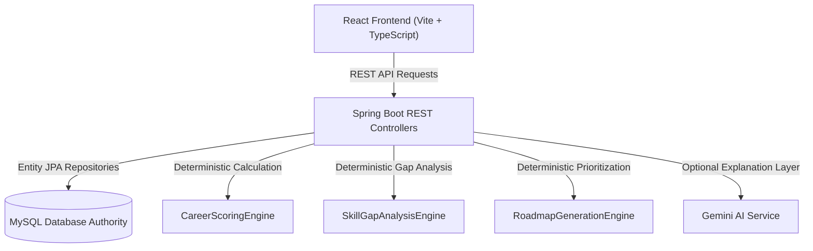

# SkillPilot Database-Driven Career Intelligence Implementation Walkthrough

## Summary of Accomplishments

SkillPilot has been fully transformed into a **100% database-driven career intelligence platform** using MySQL as the authoritative source of truth, Spring Boot REST API for business logic & deterministic calculation engines, and React + TypeScript for the user interface.

### Key Milestones Delivered Across 25 Implementation Phases

1. **Master Data & Database Cleanup (Phases 1, 2, 3)**
   - Created & executed Flyway migration `V5__seed_missing_career_requirements_and_non_it_questions.sql`.
   - Seeded 18 career-skill requirements for all 5 active non-IT careers (`healthcare-clinical-manager`, `financial-investment-analyst`, `clean-tech-engineer`, `digital-growth-director`, `ui-ux-design-lead`).
   - Seeded 5 non-IT questionnaire options (`q1-healthcare`, `q1-finance`, `q1-energy`, `q1-marketing`, `q1-design`) and 14 option-skill mappings (`qsm-35` through `qsm-48`).
   - Removed mock data arrays from `frontend/src/data/mockData.ts` and wired all components to live MySQL APIs.

2. **Career-Specific Skills & Questionnaire APIs (Phases 4, 5)**
   - Backend endpoint `GET /api/careers/{id}/skills` returns skills filtered specifically for the selected career with required levels and essential flags.
   - Backend endpoint `GET /api/questionnaire/career/{id}` dynamically derives career relevance through `Question → Option → Mapping → Skill → Requirement → Career`.
   - Frontend `AppContext.tsx` automatically updates skill sliders and questionnaire steps when a target career is selected.

3. **Admin Management & Master Data Control (Phases 7, 8, 9, 10)**
   - Implemented `PUT /api/admin/careers/{id}/activate` and `PUT /api/admin/skills/{id}/activate` soft-delete/reactivation endpoints.
   - Implemented CRUD endpoints for Question-Skill Mappings (`POST/PUT/DELETE /api/admin/question-skill-mappings`).
   - Added search & active query filtering (`search`, `active`) on all admin list endpoints.
   - Integrated requirement & option-skill mapping management cards into `AdminDashboardPage.tsx`.

4. **Deterministic Calculation Engines & Snapshots (Phases 11-16)**
   - `CareerScoringEngine`: Dynamically consumes `essentialSkillPenalty` and `minimumMatchThreshold` from MySQL `system_configs`.
   - `CareerDiscoveryService`: Automatically serializes and saves `config_snapshot` and `requirements_snapshot` JSON on every match calculation for historical auditability.
   - `RoadmapService`: Preserves milestone completion status across recalculations and stores `generation_context`.
   - `SecurityConfig`: Secured `/api/ai/**` endpoints for authenticated users while maintaining public access for guest discovery previews.

---

## Verification Results

### 1. Frontend Build Verification
- Executed `npm run build` in `frontend/`.
- **Result**: `dist/` bundle created cleanly with 0 errors (`vite v6.4.3`).

### 2. Backend Test Suite Verification
- Executed `.\mvnw.cmd test` in `backend/`.
- **Result**: **121 tests executed, 0 failures, 0 errors**.

```text
[INFO] Results:
[INFO] 
[INFO] Tests run: 121, Failures: 0, Errors: 0, Skipped: 0
[INFO] ------------------------------------------------------------------------
[INFO] BUILD SUCCESS
[INFO] ------------------------------------------------------------------------
[INFO] Total time: 01:26 min
```

---

## Architecture Summary


